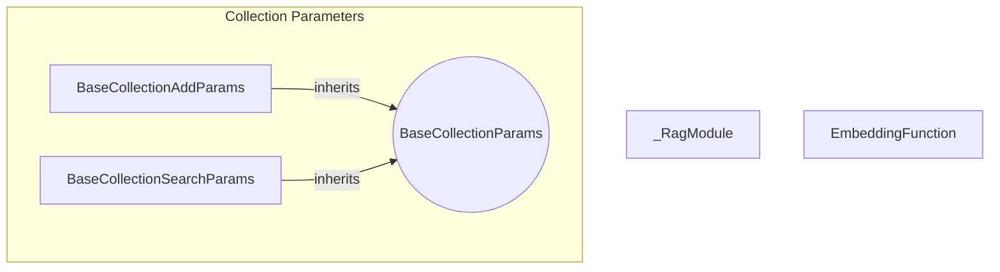

# rag_core_types
This module defines core types for RAG operations, including a module wrapper for configuration, parameter structures for adding and searching collection documents, and a protocol for embedding functions.

<!-- DIAGRAM_JSON
{
  "nodes": [
    {"id": "_RagModule", "label": "_RagModule", "type": "class"},
    {"id": "BaseCollectionAddParams", "label": "BaseCollectionAddParams", "type": "class"},
    {"id": "BaseCollectionSearchParams", "label": "BaseCollectionSearchParams", "type": "class"},
    {"id": "EmbeddingFunction", "label": "EmbeddingFunction", "type": "protocol"},
    {"id": "BaseCollectionParams", "label": "BaseCollectionParams", "type": "abstract"}
  ],
  "edges": [
    {"source": "BaseCollectionAddParams", "target": "BaseCollectionParams", "type": "inherits"},
    {"source": "BaseCollectionSearchParams", "target": "BaseCollectionParams", "type": "inherits"}
  ],
  "groups": [
    {"id": "CollectionParamsGroup", "label": "Collection Parameters", "nodes": ["BaseCollectionAddParams", "BaseCollectionSearchParams", "BaseCollectionParams"]}
  ]
}
-->
