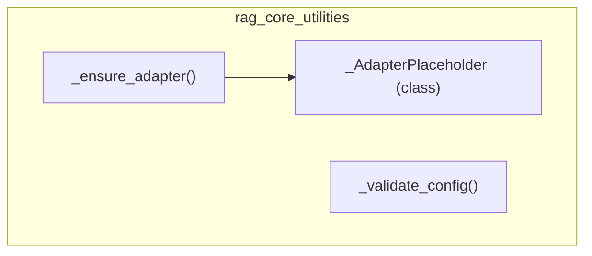

# rag_core_utilities
This module provides core utilities for RAG (Retrieval Augmented Generation) tools, including adapter management and configuration validation.

<!-- DIAGRAM_JSON
{
  "nodes": [
    {"id": "_ensure_adapter", "label": "_ensure_adapter", "type": "method"},
    {"id": "_AdapterPlaceholder", "label": "_AdapterPlaceholder", "type": "class"},
    {"id": "_validate_config", "label": "_validate_config", "type": "method"}
  ],
  "edges": [
    {"source": "_ensure_adapter", "target": "_AdapterPlaceholder", "label": "uses"}
  ],
  "groups": [
    {"id": "rag_core_utilities", "label": "rag_core_utilities", "members": ["_ensure_adapter", "_AdapterPlaceholder", "_validate_config"]}
  ]
}
-->
