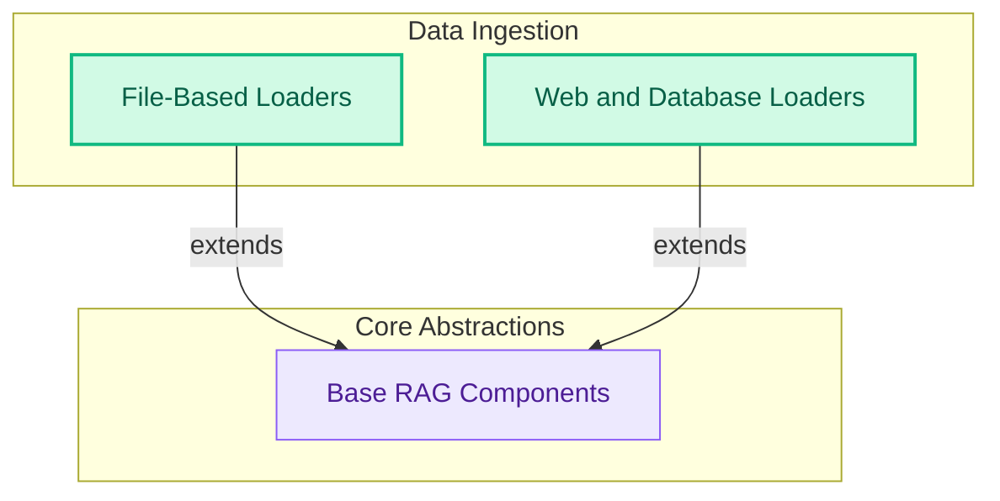

# RAG Loaders and Chunkers
This module provides a diverse set of loaders for ingesting data from various sources (files, web, databases) and chunkers for segmenting text, essential for Retrieval Augmented Generation (RAG) workflows.
<!-- DIAGRAM_JSON
{
    "direction": "TD",
    "nodes": [
        {"id": "base_components", "label": "Base RAG Components", "type": "module", "link": "base_components.md"},
        {"id": "file_loaders", "label": "File-Based Loaders", "type": "module", "link": "file_loaders.md"},
        {"id": "web_and_database_loaders", "label": "Web and Database Loaders", "type": "module", "link": "web_and_database_loaders.md"}
    ],
    "edges": [
        {"source": "file_loaders", "target": "base_components", "label": "extends"},
        {"source": "web_and_database_loaders", "target": "base_components", "label": "extends"}
    ],
    "groups": [
        {"id": "abstractions", "label": "Core Abstractions", "role": "analytical", "nodes": ["base_components"]},
        {"id": "data_ingestion", "label": "Data Ingestion", "role": "data", "nodes": ["file_loaders", "web_and_database_loaders"]}
    ]
}
-->
