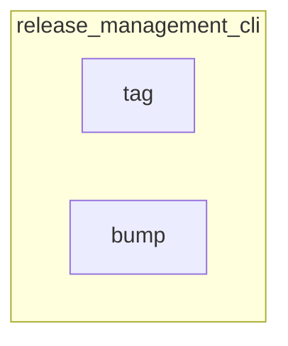

# release_management_cli
This module provides command-line interface tools for managing software releases, including bumping package versions and creating Git tags and GitHub releases.

<!-- DIAGRAM_JSON
{
    "nodes": [
        {
            "id": "tag",
            "label": "tag",
            "type": "function"
        },
        {
            "id": "bump",
            "label": "bump",
            "type": "function"
        }
    ],
    "edges": [],
    "groups": [
        {
            "id": "release_management_cli",
            "label": "release_management_cli",
            "nodes": [
                "tag",
                "bump"
            ]
        }
    ]
}
-->
