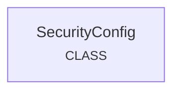

# security_management
The `security_management` module provides core configurations for CrewAI's security features, primarily managing agent identity through unique fingerprints.

<!-- DIAGRAM_JSON
{
    "nodes": [
        {
            "id": "SecurityConfig",
            "label": "SecurityConfig",
            "metadata": {
                "full_path": "lib.crewai.src.crewai.security.security_config.SecurityConfig",
                "type": "CLASS"
            }
        }
    ],
    "edges": [],
    "groups": []
}
-->
