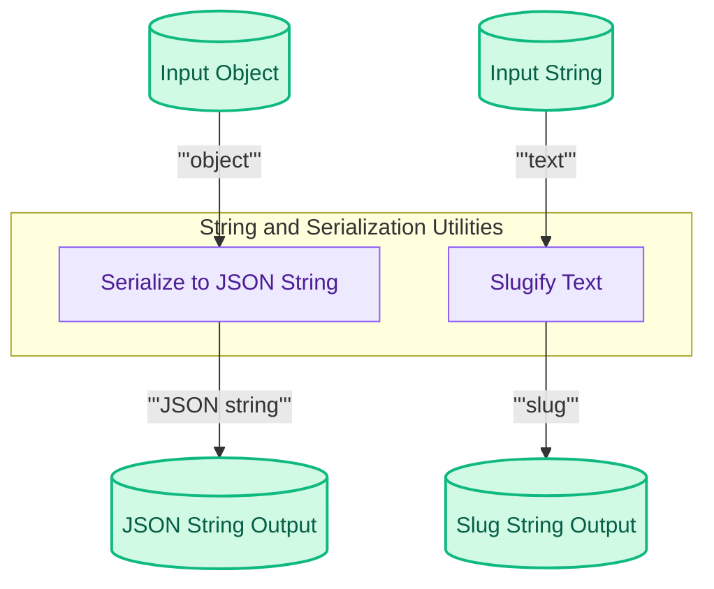

## Serialization and String Utilities

This module provides utility functions for serializing Python objects into JSON strings and for converting text into URL-safe slugs, facilitating data interchange and clean string representations.

<!-- DIAGRAM_JSON
{
    "direction": "TD",
    "nodes": [
        {
            "id": "to_string_comp",
            "label": "Serialize to JSON String",
            "type": "component",
            "link": null
        },
        {
            "id": "slugify_comp",
            "label": "Slugify Text",
            "type": "component",
            "link": null
        },
        {
            "id": "object_input",
            "label": "Input Object",
            "type": "data",
            "link": null
        },
        {
            "id": "string_input",
            "label": "Input String",
            "type": "data",
            "link": null
        },
        {
            "id": "json_output",
            "label": "JSON String Output",
            "type": "data",
            "link": null
        },
        {
            "id": "slug_output",
            "label": "Slug String Output",
            "type": "data",
            "link": null
        }
    ],
    "edges": [
        {
            "source": "object_input",
            "target": "to_string_comp",
            "label": "object"
        },
        {
            "source": "to_string_comp",
            "target": "json_output",
            "label": "JSON string"
        },
        {
            "source": "string_input",
            "target": "slugify_comp",
            "label": "text"
        },
        {
            "source": "slugify_comp",
            "target": "slug_output",
            "label": "slug"
        }
    ],
    "groups": [
        {
            "id": "utils",
            "label": "String and Serialization Utilities",
            "role": "analytical",
            "nodes": [
                "to_string_comp",
                "slugify_comp"
            ]
        }
    ]
}
-->

