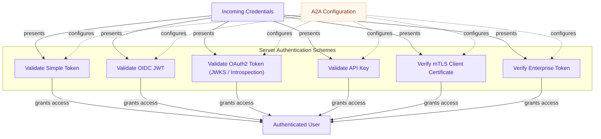

количество # Server Authentication

This module provides various server-side authentication schemes like simple token, OIDC, OAuth2, API key, and mTLS, allowing A2A servers to secure communication by validating incoming requests based on configured methods.

<!-- DIAGRAM_JSON
{
    "direction": "TD",
    "nodes": [
        {"id": "incoming_credentials", "label": "Incoming Credentials", "type": "component", "link": null},
        {"id": "simple_token", "label": "Validate Simple Token", "type": "component", "link": null},
        {"id": "oidc", "label": "Validate OIDC JWT", "type": "component", "link": null},
        {"id": "oauth2", "label": "Validate OAuth2 Token (JWKS / Introspection)", "type": "component", "link": null},
        {"id": "api_key", "label": "Validate API Key", "type": "component", "link": null},
        {"id": "mtls", "label": "Verify mTLS Client Certificate", "type": "component", "link": null},
        {"id": "enterprise", "label": "Verify Enterprise Token", "type": "component", "link": null},
        {"id": "authenticated_user", "label": "Authenticated User", "type": "component", "link": null},
        {"id": "config", "label": "A2A Configuration", "type": "external", "link": "a2a_configuration.md"}
    ],
    "edges": [
        {"source": "incoming_credentials", "target": "simple_token", "label": "presents"},
        {"source": "incoming_credentials", "target": "oidc", "label": "presents"},
        {"source": "incoming_credentials", "target": "oauth2", "label": "presents"},
        {"source": "incoming_credentials", "target": "api_key", "label": "presents"},
        {"source": "incoming_credentials", "target": "mtls", "label": "presents"},
        {"source": "incoming_credentials", "target": "enterprise", "label": "presents"},
        {"source": "config", "target": "simple_token", "label": "configures"},
        {"source": "config", "target": "oidc", "label": "configures"},
        {"source": "config", "target": "oauth2", "label": "configures"},
        {"source": "config", "target": "api_key", "label": "configures"},
        {"source": "config", "target": "mtls", "label": "configures"},
        {"source": "config", "target": "enterprise", "label": "configures"},
        {"source": "simple_token", "target": "authenticated_user", "label": "grants access"},
        {"source": "oidc", "target": "authenticated_user", "label": "grants access"},
        {"source": "oauth2", "target": "authenticated_user", "label": "grants access"},
        {"source": "api_key", "target": "authenticated_user", "label": "grants access"},
        {"source": "mtls", "target": "authenticated_user", "label": "grants access"},
        {"source": "enterprise", "target": "authenticated_user", "label": "grants access"}
    ],
    "groups": [
        {"id": "server_auth_schemes", "label": "Server Authentication Schemes", "role": "analytical", "nodes": ["simple_token", "oidc", "oauth2", "api_key", "mtls", "enterprise"]}
    ]
}
-->
