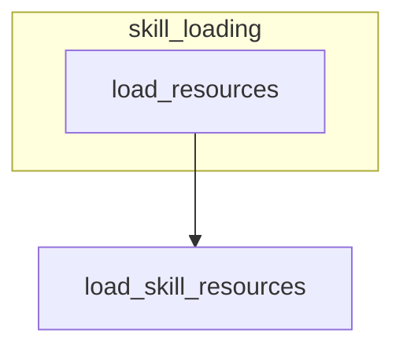

# skill_loading
This module provides the core functionality for loading resources associated with a skill, specifically promoting its disclosure level to RESOURCES.

<!-- DIAGRAM_JSON
{
    "nodes": [
        {
            "id": "skill_loading",
            "label": "skill_loading",
            "type": "module"
        },
        {
            "id": "load_resources",
            "label": "load_resources",
            "type": "function",
            "parent": "skill_loading"
        },
        {
            "id": "load_skill_resources",
            "label": "load_skill_resources",
            "type": "function"
        }
    ],
    "edges": [
        {
            "source": "load_resources",
            "target": "load_skill_resources",
            "type": "calls"
        }
    ],
    "groups": []
}
-->
