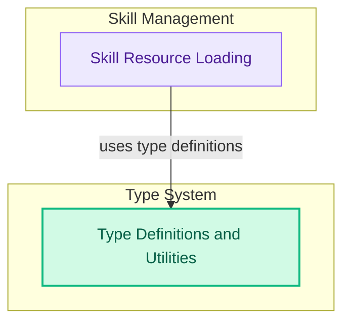

# Skills and Type Definitions
This module defines core skills functionality and essential data types for managing callbacks and streaming output, ensuring proper resource handling and data flow within the system.

<!-- DIAGRAM_JSON
{
    "direction": "TD",
    "nodes": [
        {
            "id": "skills_and_types",
            "label": "Skills and Type Definitions",
            "type": "module"
        },
        {
            "id": "skill_loading",
            "label": "Skill Resource Loading",
            "type": "module",
            "link": "skill_loading.md"
        },
        {
            "id": "type_utilities",
            "label": "Type Definitions and Utilities",
            "type": "module",
            "link": "type_utilities.md"
        }
    ],
    "edges": [
        {
            "source": "skill_loading",
            "target": "type_utilities",
            "label": "uses type definitions"
        }
    ],
    "groups": [
        {
            "id": "skill_management",
            "label": "Skill Management",
            "role": "analytical",
            "nodes": [
                "skill_loading"
            ]
        },
        {
            "id": "type_system",
            "label": "Type System",
            "role": "data",
            "nodes": [
                "type_utilities"
            ]
        }
    ]
}
-->
