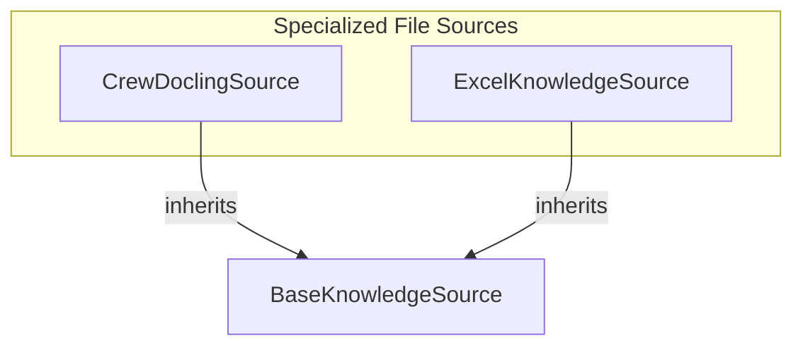

# specialized_file_sources
This module provides specialized knowledge sources for integrating various file types, including general documents (PDF, DOCX, HTML, etc.) and Excel spreadsheets, into a knowledge base.

<!-- DIAGRAM_JSON
{
    "nodes": [
        {
            "id": "specialized_file_sources",
            "label": "specialized_file_sources",
            "type": "module"
        },
        {
            "id": "CrewDoclingSource",
            "label": "CrewDoclingSource",
            "type": "class"
        },
        {
            "id": "ExcelKnowledgeSource",
            "label": "ExcelKnowledgeSource",
            "type": "class"
        },
        {
            "id": "BaseKnowledgeSource",
            "label": "BaseKnowledgeSource",
            "type": "class"
        }
    ],
    "edges": [
        {
            "source": "CrewDoclingSource",
            "target": "BaseKnowledgeSource",
            "type": "inherits"
        },
        {
            "source": "ExcelKnowledgeSource",
            "target": "BaseKnowledgeSource",
            "type": "inherits"
        }
    ],
    "groups": []
}
-->
