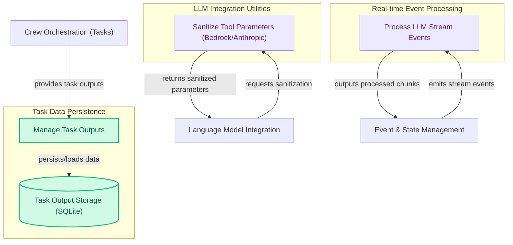

## Specialized Handlers

This module provides specialized handlers for core crew orchestration functionalities, including sanitizing tool parameters for LLM interactions, processing real-time LLM stream events, and managing the persistence of task execution outputs.

<!-- DIAGRAM_JSON
{
    "direction": "TD",
    "nodes": [
        {
            "id": "bedrock_sanitizer",
            "label": "Sanitize Tool Parameters (Bedrock/Anthropic)",
            "type": "component",
            "link": null
        },
        {
            "id": "stream_processor",
            "label": "Process LLM Stream Events",
            "type": "component",
            "link": null
        },
        {
            "id": "task_output_handler",
            "label": "Manage Task Outputs",
            "type": "component",
            "link": null
        },
        {
            "id": "task_output_db",
            "label": "Task Output Storage (SQLite)",
            "type": "data",
            "link": null
        },
        {
            "id": "llm_integration",
            "label": "Language Model Integration",
            "type": "external",
            "link": "language_model_integration.md"
        },
        {
            "id": "event_management",
            "label": "Event & State Management",
            "type": "external",
            "link": "event_and_state_management.md"
        },
        {
            "id": "crew_orchestration",
            "label": "Crew Orchestration (Tasks)",
            "type": "external",
            "link": "crew_orchestration.md"
        }
    ],
    "edges": [
        {
            "source": "llm_integration",
            "target": "bedrock_sanitizer",
            "label": "requests sanitization"
        },
        {
            "source": "bedrock_sanitizer",
            "target": "llm_integration",
            "label": "returns sanitized parameters"
        },
        {
            "source": "event_management",
            "target": "stream_processor",
            "label": "emits stream events"
        },
        {
            "source": "stream_processor",
            "target": "event_management",
            "label": "outputs processed chunks"
        },
        {
            "source": "crew_orchestration",
            "target": "task_output_handler",
            "label": "provides task outputs"
        },
        {
            "source": "task_output_handler",
            "target": "task_output_db",
            "label": "persists/loads data"
        }
    ],
    "groups": [
        {
            "id": "llm_utilities",
            "label": "LLM Integration Utilities",
            "role": "analytical",
            "nodes": [
                "bedrock_sanitizer"
            ]
        },
        {
            "id": "streaming_pipeline",
            "label": "Real-time Event Processing",
            "role": "analytical",
            "nodes": [
                "stream_processor"
            ]
        },
        {
            "id": "data_persistence",
            "label": "Task Data Persistence",
            "role": "data",
            "nodes": [
                "task_output_handler",
                "task_output_db"
            ]
        }
    ]
}
-->
