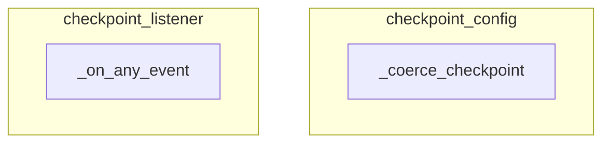

# state_checkpointing Module
This module manages automatic state checkpointing within the system, handling configuration coercion and event-driven checkpointing logic to persist state changes.

<!-- DIAGRAM_JSON
{
  "nodes": [
    {"id": "_coerce_checkpoint", "label": "_coerce_checkpoint"},
    {"id": "_on_any_event", "label": "_on_any_event"}
  ],
  "edges": [],
  "groups": [
    {"id": "checkpoint_config", "label": "checkpoint_config", "nodes": ["_coerce_checkpoint"]},
    {"id": "checkpoint_listener", "label": "checkpoint_listener", "nodes": ["_on_any_event"]}
  ]
}
-->
