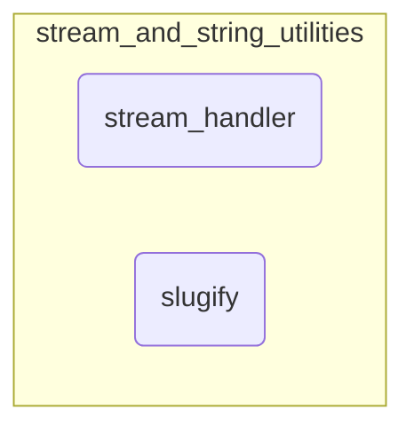

# stream_and_string_utilities
This module provides utilities for handling LLM stream chunks and converting text into URL-safe slugs. It encapsulates distinct functionalities for real-time data processing and string manipulation.

<!-- DIAGRAM_JSON
{
  "nodes": [
    {
      "id": "stream_handler",
      "label": "stream_handler",
      "type": "function"
    },
    {
      "id": "slugify",
      "label": "slugify",
      "type": "function"
    }
  ],
  "edges": [],
  "groups": [
    {
      "id": "stream_and_string_utilities",
      "label": "stream_and_string_utilities",
      "type": "module",
      "contains": ["stream_handler", "slugify"]
    }
  ]
}
-->
