# structured_file_search
The `structured_file_search` module offers tools for semantic content retrieval from various structured file types. It includes specialized search functionalities for CSV, DOCX, JSON, MDX, and PDF documents, each with a dedicated input schema.

<!-- DIAGRAM_JSON
{
  "nodes": [
    { "id": "CSVSearchTool", "label": "CSVSearchTool", "type": "class" },
    { "id": "CSVSearchToolSchema", "label": "CSVSearchToolSchema", "type": "class" },
    { "id": "DOCXSearchTool", "label": "DOCXSearchTool", "type": "class" },
    { "id": "DOCXSearchToolSchema", "label": "DOCXSearchToolSchema", "type": "class" },
    { "id": "JSONSearchTool", "label": "JSONSearchTool", "type": "class" },
    { "id": "JSONSearchToolSchema", "label": "JSONSearchToolSchema", "type": "class" },
    { "id": "MDXSearchTool", "label": "MDXSearchTool", "type": "class" },
    { "id": "MDXSearchToolSchema", "label": "MDXSearchToolSchema", "type": "class" },
    { "id": "PDFSearchTool", "label": "PDFSearchTool", "type": "class" },
    { "id": "PDFSearchToolSchema", "label": "PDFSearchToolSchema", "type": "class" }
  ],
  "edges": [
    { "source": "CSVSearchTool", "target": "CSVSearchToolSchema", "label": "uses", "type": "association" },
    { "source": "DOCXSearchTool", "target": "DOCXSearchToolSchema", "label": "uses", "type": "association" },
    { "source": "JSONSearchTool", "target": "JSONSearchToolSchema", "label": "uses", "type": "association" },
    { "source": "MDXSearchTool", "target": "MDXSearchToolSchema", "label": "uses", "type": "association" },
    { "source": "PDFSearchTool", "target": "PDFSearchToolSchema", "label": "uses", "type": "association" }
  ],
  "groups": [
    {
      "id": "csv_tools",
      "label": "CSV Search",
      "nodes": ["CSVSearchTool", "CSVSearchToolSchema"]
    },
    {
      "id": "docx_tools",
      "label": "DOCX Search",
      "nodes": ["DOCXSearchTool", "DOCXSearchToolSchema"]
    },
    {
      "id": "json_tools",
      "label": "JSON Search",
      "nodes": ["JSONSearchTool", "JSONSearchToolSchema"]
    },
    {
      "id": "mdx_tools",
      "label": "MDX Search",
      "nodes": ["MDXSearchTool", "MDXSearchToolSchema"]
    },
    {
      "id": "pdf_tools",
      "label": "PDF Search",
      "nodes": ["PDFSearchTool", "PDFSearchToolSchema"]
    }
  ]
}
-->

```mermaid
flowchart TD
    subgraph CSV Search
        CSVSearchTool[CSVSearchTool]
        CSVSearchToolSchema[CSVSearchToolSchema]
        CSVSearchTool --> CSVSearchToolSchema
    end

    subgraph DOCX Search
        DOCXSearchTool[DOCXSearchTool]
        DOCXSearchToolSchema[DOCXSearchToolSchema]
        DOCXSearchTool --> DOCXSearchToolSchema
    end

    subgraph JSON Search
        JSONSearchTool[JSONSearchTool]
        JSONSearchToolSchema[JSONSearchToolSchema]
        JSONSearchTool --> JSONSearchToolSchema
    end

    subgraph MDX Search
        MDXSearchTool[MDXSearchTool]
        MDXSearchToolSchema[MDXSearchToolSchema]
        MDXSearchTool --> MDXSearchToolSchema
    end

    subgraph PDF Search
        PDFSearchTool[PDFSearchTool]
        PDFSearchToolSchema[PDFSearchToolSchema]
        PDFSearchTool --> PDFSearchToolSchema
    end
```
