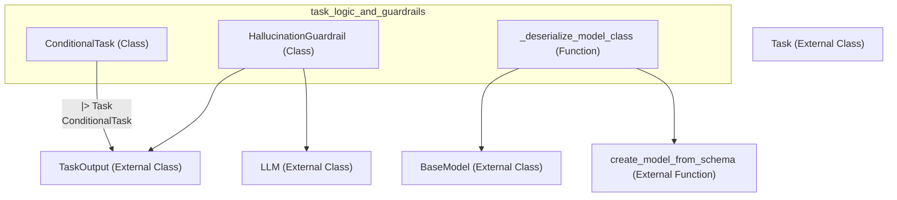

# task_logic_and_guardrails
This module provides components for managing task execution flow, including a conditional task type and a placeholder for hallucination detection guardrails, alongside a utility for deserializing Pydantic models.

<!-- DIAGRAM_JSON
{
  "nodes": [
    {"id": "ConditionalTask", "label": "ConditionalTask", "type": "class"},
    {"id": "HallucinationGuardrail", "label": "HallucinationGuardrail", "type": "class"},
    {"id": "_deserialize_model_class", "label": "_deserialize_model_class", "type": "function"},
    {"id": "Task", "label": "Task", "type": "class", "isExternal": true},
    {"id": "TaskOutput", "label": "TaskOutput", "type": "class", "isExternal": true},
    {"id": "LLM", "label": "LLM", "type": "class", "isExternal": true},
    {"id": "BaseModel", "label": "BaseModel", "type": "class", "isExternal": true},
    {"id": "create_model_from_schema", "label": "create_model_from_schema", "type": "function", "isExternal": true}
  ],
  "edges": [
    {"source": "ConditionalTask", "target": "Task", "type": "inheritance"},
    {"source": "ConditionalTask", "target": "TaskOutput", "type": "uses"},
    {"source": "HallucinationGuardrail", "target": "LLM", "type": "uses"},
    {"source": "HallucinationGuardrail", "target": "TaskOutput", "type": "uses"},
    {"source": "_deserialize_model_class", "target": "BaseModel", "type": "uses"},
    {"source": "_deserialize_model_class", "target": "create_model_from_schema", "type": "calls"}
  ],
  "groups": [
    {"id": "task_logic_and_guardrails", "label": "task_logic_and_guardrails", "nodes": ["ConditionalTask", "HallucinationGuardrail", "_deserialize_model_class"]}
  ]
}
-->
