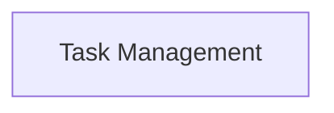

<!-- AUTO_GENERATED_PLACEHOLDER
  reason: LLM did not create .md file for this module
  module_path: crewai_core_framework/tasks_and_flow/task_management
  component_count: 3
  generated_at: 2026-05-07T03:07:02.958663
-->

# Task Management

Manages individual tasks within a flow, including conditional execution and guardrails for output quality.

<!-- DIAGRAM_JSON
{
    "direction": "TD",
    "nodes": [
        {
            "id": "task_management",
            "label": "Task Management",
            "type": "module",
            "title": "Task Management",
            "description": "Manages individual tasks within a flow, including conditional execution and guardrails for output quality."
        }
    ],
    "edges": [],
    "groups": []
}
-->

