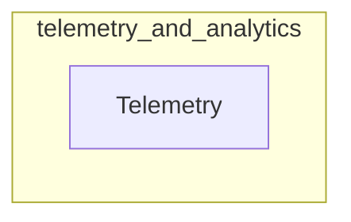

# telemetry_and_analytics
This module provides the `Telemetry` class, a singleton responsible for initializing and managing anonymous telemetry for the CrewAI package using OpenTelemetry. It handles tracer setup and span processing, with options to disable telemetry via environment variables.

<!-- DIAGRAM_JSON
{
    "nodes": [
        {
            "id": "telemetry_and_analytics",
            "label": "telemetry_and_analytics",
            "type": "module"
        },
        {
            "id": "Telemetry",
            "label": "Telemetry",
            "type": "class"
        }
    ],
    "edges": [
        {
            "source": "telemetry_and_analytics",
            "target": "Telemetry",
            "type": "contains"
        }
    ],
    "groups": [
        {
            "id": "telemetry_and_analytics_group",
            "label": "telemetry_and_analytics",
            "nodes": [
                "Telemetry"
            ]
        }
    ]
}
-->
