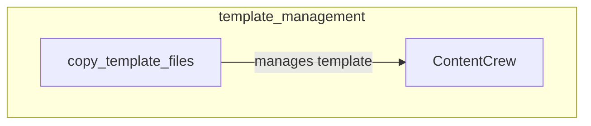

# template_management
This module provides utilities for managing code templates, including a function to copy template files and a concrete example of a CrewAI content generation crew template.

<!-- DIAGRAM_JSON
{
    "nodes": [
        {
            "id": "copy_template_files",
            "label": "copy_template_files",
            "full_path": "lib.cli.src.crewai_cli.create_crew.copy_template_files"
        },
        {
            "id": "ContentCrew",
            "label": "ContentCrew",
            "full_path": "lib.cli.src.crewai_cli.templates.flow.crews.content_crew.content_crew.ContentCrew"
        }
    ],
    "edges": [
        {
            "source": "copy_template_files",
            "target": "ContentCrew",
            "label": "manages template"
        }
    ],
    "groups": []
}
-->
