# tool_adapters_and_specs Module
This module provides various adapters for integrating tools and agents, including enterprise action kits, RAG systems, and LanceDB. It also offers utilities for extracting tool specifications, filtering tools, and converting tool formats, alongside base classes for agent-related tools and converter adapters.

<!-- DIAGRAM_JSON
{
    "nodes": [
        {
            "id": "tool_adapters_and_specs",
            "label": "tool_adapters_and_specs",
            "type": "module"
        },
        {
            "id": "EnterpriseActionKitToolAdapter",
            "label": "EnterpriseActionKitToolAdapter",
            "group": "Tool Adapters"
        },
        {
            "id": "LanceDBAdapter",
            "label": "LanceDBAdapter",
            "group": "Tool Adapters"
        },
        {
            "id": "RAGAdapter",
            "label": "RAGAdapter",
            "group": "Tool Adapters"
        },
        {
            "id": "ToolSpecExtractor",
            "label": "ToolSpecExtractor",
            "group": "Tool Specifications"
        },
        {
            "id": "BaseConverterAdapter",
            "label": "BaseConverterAdapter",
            "group": "Agent Adapters"
        },
        {
            "id": "LangGraphAgentAdapter",
            "label": "LangGraphAgentAdapter",
            "group": "Agent Adapters"
        },
        {
            "id": "OpenAIAgentAdapter",
            "label": "OpenAIAgentAdapter",
            "group": "Agent Adapters"
        },
        {
            "id": "create_static_tool_filter",
            "label": "create_static_tool_filter",
            "group": "Tool Utilities"
        },
        {
            "id": "BaseAgentTool",
            "label": "BaseAgentTool",
            "group": "Core Tools"
        },
        {
            "id": "to_langchain",
            "label": "to_langchain",
            "group": "Tool Utilities"
        },
        {
            "id": "Adapter",
            "label": "Adapter",
            "group": "External"
        },
        {
            "id": "ABC",
            "label": "ABC",
            "group": "External"
        },
        {
            "id": "BaseAgentAdapter",
            "label": "BaseAgentAdapter",
            "group": "External"
        },
        {
            "id": "BaseTool",
            "label": "BaseTool",
            "group": "External"
        },
        {
            "id": "BaseAgent",
            "label": "BaseAgent",
            "group": "External"
        },
        {
            "id": "CrewStructuredTool",
            "label": "CrewStructuredTool",
            "group": "External"
        },
        {
            "id": "StaticToolFilter",
            "label": "StaticToolFilter",
            "group": "External"
        },
        {
            "id": "tool_specs_and_utilities",
            "label": "Tool Specifications and Utilities",
            "type": "module",
            "link": "tool_specs_and_utilities.md"
        },
        {
            "id": "tool_adapters",
            "label": "Tool Adapters",
            "type": "module",
            "link": "tool_adapters.md"
        },
        {
            "id": "agent_integration_adapters",
            "label": "Agent Integration Adapters",
            "type": "module",
            "link": "agent_integration_adapters.md"
        }
    ],
    "edges": [
        {
            "source": "LanceDBAdapter",
            "target": "Adapter",
            "label": "inherits"
        },
        {
            "source": "RAGAdapter",
            "target": "Adapter",
            "label": "inherits"
        },
        {
            "source": "BaseConverterAdapter",
            "target": "ABC",
            "label": "inherits"
        },
        {
            "source": "BaseConverterAdapter",
            "target": "BaseAgentAdapter",
            "label": "composes"
        },
        {
            "source": "LangGraphAgentAdapter",
            "target": "BaseAgentAdapter",
            "label": "inherits"
        },
        {
            "source": "LangGraphAgentAdapter",
            "target": "BaseTool",
            "label": "uses"
        },
        {
            "source": "OpenAIAgentAdapter",
            "target": "BaseAgentAdapter",
            "label": "inherits"
        },
        {
            "source": "OpenAIAgentAdapter",
            "target": "BaseTool",
            "label": "uses"
        },
        {
            "source": "BaseAgentTool",
            "target": "BaseTool",
            "label": "inherits"
        },
        {
            "source": "BaseAgentTool",
            "target": "BaseAgent",
            "label": "composes"
        },
        {
            "source": "to_langchain",
            "target": "BaseTool",
            "label": "uses"
        },
        {
            "source": "to_langchain",
            "target": "CrewStructuredTool",
            "label": "uses"
        },
        {
            "source": "ToolSpecExtractor",
            "target": "BaseTool",
            "label": "extracts from"
        },
        {
            "source": "create_static_tool_filter",
            "target": "StaticToolFilter",
            "label": "returns"
        },
        {
            "source": "tool_adapters_and_specs",
            "target": "tool_specs_and_utilities"
        },
        {
            "source": "tool_adapters_and_specs",
            "target": "tool_adapters"
        },
        {
            "source": "tool_adapters_and_specs",
            "target": "agent_integration_adapters"
        }
    ],
    "groups": []
}
-->
```

```mermaid
flowchart TD
    subgraph tool_adapters["Tool Adapters"]
        EAKTA[EnterpriseActionKitToolAdapter]
        LDBA[LanceDBAdapter]
        RAGA[RAGAdapter]
    end

    subgraph agent_adapters["Agent Adapters"]
        BCA[BaseConverterAdapter]
        LGAA[LangGraphAgentAdapter]
        OAAA[OpenAIAgentAdapter]
    end

    subgraph tool_specs["Tool Specifications"]
        TSE[ToolSpecExtractor]
    end

    subgraph core_tools["Core Tools"]
        BAT[BaseAgentTool]
    end

    subgraph tool_utils["Tool Utilities"]
        CSTF[create_static_tool_filter]
        TLC[to_langchain]
    end

    subgraph external_deps["External Dependencies"]
        Adapter(Adapter)
        ABC(ABC)
        BAA(BaseAgentAdapter)
        BT(BaseTool)
        BA(BaseAgent)
        CST(CrewStructuredTool)
        STF(StaticToolFilter)
    end

    LDBA -->|"inherits"| Adapter
    RAGA -->|"inherits"| Adapter
    BCA -->|"inherits"| ABC
    BCA -->|"associates with"| BAA
    LGAA -->|"inherits"| BAA
    LGAA --> BT
    OAAA -->|"inherits"| BAA
    OAAA --> BT
    BAT -->|"inherits"| BT
    BAT -->|"associates with"| BA
    TLC --> BT
    TLC --> CST
    TSE --> BT
    CSTF --> STF
```
