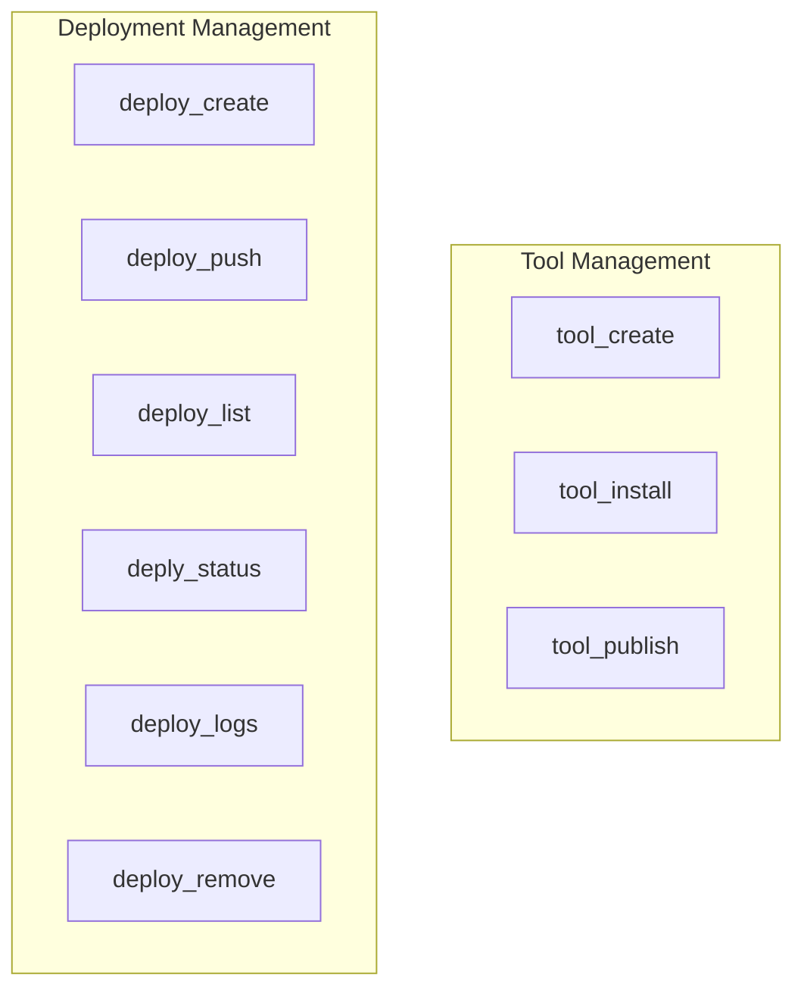

# tool_and_deploy_management
This module provides CLI functions for managing CrewAI tools and deployments. It includes operations for creating, installing, and publishing tools, alongside comprehensive deployment lifecycle management.

<!-- DIAGRAM_JSON
{
  "nodes": [
    {"id": "tool_create", "label": "tool_create"},
    {"id": "tool_install", "label": "tool_install"},
    {"id": "tool_publish", "label": "tool_publish"},
    {"id": "deploy_create", "label": "deploy_create"},
    {"id": "deploy_push", "label": "deploy_push"},
    {"id": "deploy_list", "label": "deploy_list"},
    {"id": "deply_status", "label": "deply_status"},
    {"id": "deploy_logs", "label": "deploy_logs"},
    {"id": "deploy_remove", "label": "deploy_remove"}
  ],
  "edges": [],
  "groups": [
    {
      "id": "tool_management",
      "label": "Tool Management",
      "nodes": ["tool_create", "tool_install", "tool_publish"]
    },
    {
      "id": "deployment_management",
      "label": "Deployment Management",
      "nodes": ["deploy_create", "deploy_push", "deploy_list", "deply_status", "deploy_logs", "deploy_remove"]
    }
  ]
}
-->
