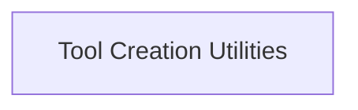

<!-- AUTO_GENERATED_PLACEHOLDER
  reason: LLM did not create .md file for this module
  module_path: tools_and_integrations/general_purpose_tools/lib_crewai_src/tool_builders
  component_count: 3
  generated_at: 2026-05-07T03:07:02.961398
-->

# Tool Creation Utilities

Contains functions and decorators for constructing CrewAI tools from Python functions, ensuring proper schema and documentation.

<!-- DIAGRAM_JSON
{
    "direction": "TD",
    "nodes": [
        {
            "id": "tool_builders",
            "label": "Tool Creation Utilities",
            "type": "module",
            "title": "Tool Creation Utilities",
            "description": "Contains functions and decorators for constructing CrewAI tools from Python functions, ensuring proper schema and documentation."
        }
    ],
    "edges": [],
    "groups": []
}
-->

