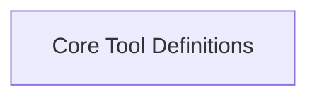

<!-- AUTO_GENERATED_PLACEHOLDER
  reason: LLM did not create .md file for this module
  module_path: tools_and_integrations/general_purpose_tools/lib_crewai_src/tool_core
  component_count: 2
  generated_at: 2026-05-07T03:07:02.961539
-->

# Core Tool Definitions

Provides the fundamental building blocks and execution logic for tools, including the `BaseAgentTool` for agent delegation.

<!-- DIAGRAM_JSON
{
    "direction": "TD",
    "nodes": [
        {
            "id": "tool_core",
            "label": "Core Tool Definitions",
            "type": "module",
            "title": "Core Tool Definitions",
            "description": "Provides the fundamental building blocks and execution logic for tools, including the `BaseAgentTool` for agent delegation."
        }
    ],
    "edges": [],
    "groups": []
}
-->

