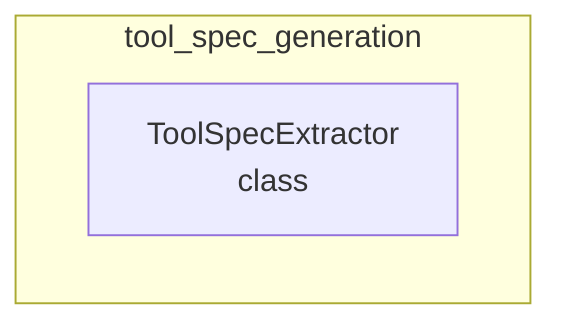

# tool_spec_generation
This module provides the `ToolSpecExtractor` class, designed to programmatically discover and extract detailed specifications for various tools, including their schemas, parameters, and dependencies, for dynamic integration.

<!-- DIAGRAM_JSON
{
  "nodes": [
    {"id": "ToolSpecExtractor", "label": "ToolSpecExtractor", "type": "class"}
  ],
  "edges": [],
  "groups": [
    {"id": "tool_spec_generation", "label": "tool_spec_generation", "nodes": ["ToolSpecExtractor"]}
  ]
}
-->
