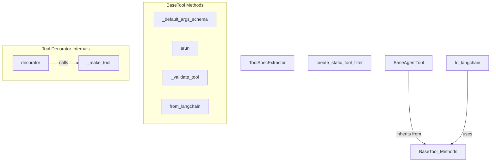

# tool_specs_and_utilities
This module offers utilities for extracting tool specifications, creating static tool filters, and managing core functionalities for `BaseTool` and `BaseAgentTool` classes, covering schema generation, async execution, and Langchain tool conversion.
<!-- DIAGRAM_JSON
{
    "nodes": [
        {
            "id": "ToolSpecExtractor",
            "label": "ToolSpecExtractor",
            "type": "class"
        },
        {
            "id": "create_static_tool_filter",
            "label": "create_static_tool_filter",
            "type": "function"
        },
        {
            "id": "BaseAgentTool",
            "label": "BaseAgentTool",
            "type": "class"
        },
        {
            "id": "to_langchain",
            "label": "to_langchain",
            "type": "function"
        },
        {
            "id": "_default_args_schema",
            "label": "_default_args_schema",
            "type": "method"
        },
        {
            "id": "_make_tool",
            "label": "_make_tool",
            "type": "function"
        },
        {
            "id": "arun",
            "label": "arun",
            "type": "method"
        },
        {
            "id": "_validate_tool",
            "label": "_validate_tool",
            "type": "function"
        },
        {
            "id": "from_langchain",
            "label": "from_langchain",
            "type": "method"
        },
        {
            "id": "decorator",
            "label": "decorator",
            "type": "function"
        },
        {
            "id": "BaseTool_Methods",
            "label": "BaseTool_Methods",
            "type": "external",
            "_repaired": "g2_injected_endpoint"
        }
    ],
    "edges": [
        {
            "source": "BaseAgentTool",
            "target": "BaseTool_Methods",
            "label": "inherits from",
            "type": "inheritance"
        },
        {
            "source": "to_langchain",
            "target": "BaseTool_Methods",
            "label": "uses",
            "type": "association"
        },
        {
            "source": "decorator",
            "target": "_make_tool",
            "label": "calls",
            "type": "call"
        }
    ],
    "groups": []
}
-->
