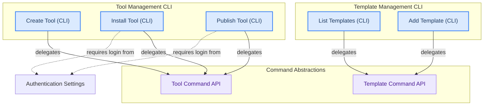

## Tool and Template Management
This module provides command-line functionalities for managing tools and templates, including creating, installing, and publishing tools, as well as listing and adding project templates.

<!-- DIAGRAM_JSON
{
    "direction": "TD",
    "nodes": [
        {
            "id": "tool_create",
            "label": "Create Tool (CLI)",
            "type": "component",
            "link": null
        },
        {
            "id": "tool_install",
            "label": "Install Tool (CLI)",
            "type": "component",
            "link": null
        },
        {
            "id": "tool_publish",
            "label": "Publish Tool (CLI)",
            "type": "component",
            "link": null
        },
        {
            "id": "template_list",
            "label": "List Templates (CLI)",
            "type": "component",
            "link": null
        },
        {
            "id": "template_add",
            "label": "Add Template (CLI)",
            "type": "component",
            "link": null
        },
        {
            "id": "tool_command_api",
            "label": "Tool Command API",
            "type": "component",
            "link": null
        },
        {
            "id": "template_command_api",
            "label": "Template Command API",
            "type": "component",
            "link": null
        },
        {
            "id": "auth_settings",
            "label": "Authentication Settings",
            "type": "external",
            "link": "authentication_settings.md"
        }
    ],
    "edges": [
        {
            "source": "tool_create",
            "target": "tool_command_api",
            "label": "delegates"
        },
        {
            "source": "tool_install",
            "target": "tool_command_api",
            "label": "delegates"
        },
        {
            "source": "tool_publish",
            "target": "tool_command_api",
            "label": "delegates"
        },
        {
            "source": "template_list",
            "target": "template_command_api",
            "label": "delegates"
        },
        {
            "source": "template_add",
            "target": "template_command_api",
            "label": "delegates"
        },
        {
            "source": "tool_install",
            "target": "auth_settings",
            "label": "requires login from"
        },
        {
            "source": "tool_publish",
            "target": "auth_settings",
            "label": "requires login from"
        }
    ],
    "groups": [
        {
            "id": "tool_cli",
            "label": "Tool Management CLI",
            "role": "surface",
            "nodes": [
                "tool_create",
                "tool_install",
                "tool_publish"
            ]
        },
        {
            "id": "template_cli",
            "label": "Template Management CLI",
            "role": "surface",
            "nodes": [
                "template_list",
                "template_add"
            ]
        },
        {
            "id": "command_apis",
            "label": "Command Abstractions",
            "role": "analytical",
            "nodes": [
                "tool_command_api",
                "template_command_api"
            ]
        }
    ]
}
-->
