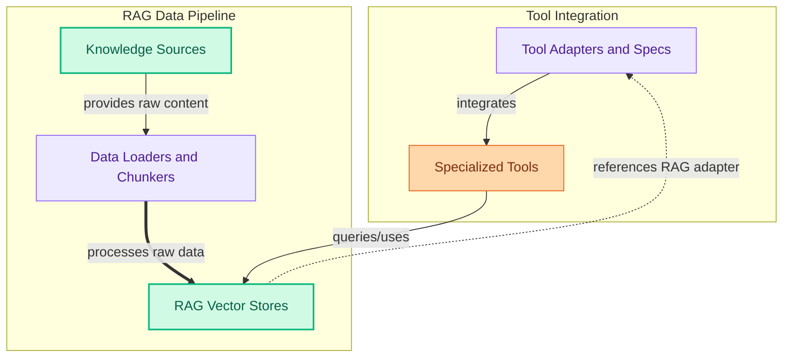

The `tools_and_rag` module is the central hub for integrating and managing external tools and Retrieval Augmented Generation (RAG) capabilities within CrewAI. It provides a rich ecosystem of specialized tools for diverse tasks (e.g., web scraping, database querying, code execution), flexible data loaders and chunkers for ingesting various data formats, and robust vector store integrations (ChromaDB, Qdrant) for efficient knowledge retrieval. Furthermore, it offers adapters to seamlessly integrate these tools and RAG systems with different agent frameworks and defines various knowledge sources for structured content, enabling agents to interact with the real world and leverage vast amounts of information.

<!-- DIAGRAM_JSON
{
    "direction": "TD",
    "nodes": [
        {
            "id": "tools_and_rag",
            "label": "Tools And Rag",
            "type": "module"
        },
        {
            "id": "tool_adapters",
            "label": "Tool Adapters and Specs",
            "type": "module",
            "link": "tool_adapters_and_specs.md"
        },
        {
            "id": "data_loaders",
            "label": "Data Loaders and Chunkers",
            "type": "module",
            "link": "data_loaders_and_chunkers.md"
        },
        {
            "id": "specialized_tools_collection",
            "label": "Specialized Tools",
            "type": "module",
            "link": "specialized_tools.md"
        },
        {
            "id": "vector_stores",
            "label": "RAG Vector Stores",
            "type": "module",
            "link": "rag_vector_stores.md"
        },
        {
            "id": "knowledge_sources_repo",
            "label": "Knowledge Sources",
            "type": "module",
            "link": "knowledge_sources.md"
        },
        {
            "id": "tool_adapters_and_specs",
            "label": "tool_adapters_and_specs",
            "type": "module",
            "link": "tool_adapters_and_specs.md"
        },
        {
            "id": "data_loaders_and_chunkers",
            "label": "data_loaders_and_chunkers",
            "type": "module",
            "link": "data_loaders_and_chunkers.md"
        },
        {
            "id": "specialized_tools",
            "label": "Specialized Tools",
            "type": "module",
            "link": "specialized_tools.md"
        },
        {
            "id": "rag_vector_stores",
            "label": "rag_vector_stores",
            "type": "module",
            "link": "rag_vector_stores.md"
        },
        {
            "id": "knowledge_sources",
            "label": "Knowledge Sources",
            "type": "module",
            "link": "knowledge_sources.md"
        }
    ],
    "edges": [
        {
            "source": "tool_adapters",
            "target": "specialized_tools_collection",
            "label": "integrates"
        },
        {
            "source": "data_loaders",
            "target": "vector_stores",
            "label": "processes raw data"
        },
        {
            "source": "knowledge_sources_repo",
            "target": "data_loaders",
            "label": "provides raw content"
        },
        {
            "source": "specialized_tools_collection",
            "target": "vector_stores",
            "label": "queries/uses"
        },
        {
            "source": "vector_stores",
            "target": "tool_adapters",
            "label": "references RAG adapter"
        },
        {
            "source": "tools_and_rag",
            "target": "tool_adapters_and_specs"
        },
        {
            "source": "tools_and_rag",
            "target": "data_loaders_and_chunkers"
        },
        {
            "source": "tools_and_rag",
            "target": "specialized_tools"
        },
        {
            "source": "tools_and_rag",
            "target": "rag_vector_stores"
        },
        {
            "source": "tools_and_rag",
            "target": "knowledge_sources"
        }
    ],
    "groups": [
        {
            "id": "tool_integration_group",
            "label": "Tool Integration",
            "nodes": [
                "tool_adapters",
                "specialized_tools_collection"
            ]
        },
        {
            "id": "rag_data_pipeline_group",
            "label": "RAG Data Pipeline",
            "nodes": [
                "knowledge_sources_repo",
                "data_loaders",
                "vector_stores"
            ]
        }
    ]
}
-->

### Core Components Documentation

The `tools_and_rag` module is composed of the following key sub-modules, each providing specialized functionalities:

*   **Tool Adapters and Specs**: Handles the integration of various external tools and agent frameworks, providing mechanisms for extracting tool specifications, dynamic tool creation, and filtering.
    *   `lib.crewai-tools.src.crewai_tools.adapters.enterprise_adapter.EnterpriseActionKitToolAdapter`
    *   `lib.crewai-tools.src.crewai_tools.adapters.lancedb_adapter.LanceDBAdapter`
    *   `lib.crewai-tools.src.crewai_tools.adapters.rag_adapter.RAGAdapter`
    *   `lib.crewai-tools.src.crewai_tools.generate_tool_specs.ToolSpecExtractor`
    *   `lib.crewai.src.crewai.agents.agent_adapters.base_converter_adapter.BaseConverterAdapter`
    *   `lib.crewai.src.crewai.agents.agent_adapters.langgraph.langgraph_adapter.LangGraphAgentAdapter`
    *   `lib.crewai.src.crewai.agents.agent_adapters.openai_agents.openai_adapter.OpenAIAgentAdapter`
    *   `lib.crewai.src.crewai.mcp.filters.create_static_tool_filter`
    *   `lib.crewai.src.crewai.tools.agent_tools.base_agent_tools.BaseAgentTool`
    *   `lib.crewai.src.crewai.tools.base_tool.to_langchain`
    *   `lib.crewai.src.crewai.tools.base_tool._default_args_schema`
    *   `lib.crewai.src.crewai.tools.base_tool._make_tool`
    *   `lib.crewai.src.crewai.tools.base_tool.arun`
    *   `lib.crewai.src.crewai.tools.base_tool._validate_tool`
    *   `lib.crewai.src.crewai.tools.base_tool.from_langchain`
    *   `lib.crewai.src.crewai.tools.base_tool.decorator`

*   **Data Loaders and Chunkers**: Provides a comprehensive collection of data loaders for various formats (CSV, DOCX, JSON, PDF, etc.) and sources (web, GitHub, databases), along with a base chunker for text segmentation.
    *   `lib.crewai-tools.src.crewai_tools.rag.base_loader.BaseLoader`
    *   `lib.crewai-tools.src.crewai_tools.rag.chunkers.base_chunker.BaseChunker`
    *   `lib.crewai-tools.src.crewai_tools.rag.loaders.csv_loader.CSVLoader`
    *   `lib.crewai-tools.src.crewai_tools.rag.loaders.directory_loader.DirectoryLoader`
    *   `lib.crewai-tools.src.crewai_tools.rag.loaders.docs_site_loader.DocsSiteLoader`
    *   `lib.crewai-tools.src.crewai_tools.rag.loaders.docx_loader.DOCXLoader`
    *   `lib.crewai-tools.src.crewai_tools.rag.loaders.github_loader.GithubLoader`
    *   `lib.crewai-tools.src.crewai_tools.rag.loaders.json_loader.JSONLoader`
    *   `lib.crewai-tools.src.crewai_tools.rag.loaders.mdx_loader.MDXLoader`
    *   `lib.crewai-tools.src.crewai_tools.rag.loaders.mysql_loader.MySQLLoader`
    *   `lib.crewai-tools.src.crewai_tools.rag.loaders.pdf_loader.PDFLoader`
    *   `lib.crewai-tools.src.crewai_tools.rag.loaders.postgres_loader.PostgresLoader`
    *   `lib.crewai-tools.src.crewai_tools.rag.loaders.text_loader.TextFileLoader`
    *   `lib.crewai-tools.src.crewai_tools.rag.loaders.text_loader.TextLoader`
    *   `lib.crewai-tools.src.crewai_tools.rag.loaders.webpage_loader.WebPageLoader`
    *   `lib.crewai-tools.src.crewai_tools.rag.loaders.xml_loader.XMLLoader`
    *   `lib.crewai-tools.src.crewai_tools.rag.loaders.youtube_channel_loader.YoutubeChannelLoader`
    *   `lib.crewai-tools.src.crewai_tools.rag.loaders.youtube_video_loader.YoutubeVideoLoader`

*   **Specialized Tools**: Contains a vast array of pre-built tools for various functionalities, including AWS Bedrock integrations, web search and scraping (Brave, Bright Data, Exa, Firecrawl, Jina, Oxylabs, SerpApi, Serper.dev, Serply, Spider, Tavily), AI agent and code execution (AI-Mind, Apify, Contextual AI, Daytona, E2B), database querying (Couchbase, Databricks, MongoDB, MySQL, NL2SQL, Qdrant, SingleStore, Snowflake, Weaviate), file and document operations (CSV, DOCX, Directory, File, JSON, MDX, PDF, TXT, XML, FileCompressor, OCR), and more.
    *   `lib.crewai-tools.src.crewai_tools.aws.bedrock.agents.invoke_agent_tool.BedrockInvokeAgentTool`
    *   `lib.crewai-tools.src.crewai_tools.aws.bedrock.browser.browser_toolkit.create_browser_toolkit`
    *   `lib.crewai-tools.src.crewai_tools.aws.bedrock.code_interpreter.code_interpreter_toolkit.create_code_interpreter_toolkit`
    *   `lib.crewai-tools.src.crewai_tools.aws.bedrock.knowledge_base.retriever_tool.BedrockKBRetrieverTool`
    *   `lib.crewai-tools.src.crewai_tools.tools.ai_mind_tool.ai_mind_tool.AIMindTool`
    *   `lib.crewai-tools.src.crewai_tools.tools.apify_actors_tool.apify_actors_tool.ApifyActorsTool`
    *   `lib.crewai-tools.src.crewai_tools.tools.arxiv_paper_tool.arxiv_paper_tool.ArxivPaperTool`
    *   `lib.crewai-tools.src.crewai_tools.tools.brave_search_tool.base.BraveSearchToolBase`
    *   `lib.crewai-tools.src.crewai_tools.tools.brave_search_tool.brave_local_pois_tool.BraveLocalPOIsTool`
    *   `lib.crewai-tools.src.crewai_tools.tools.brave_search_tool.brave_search_tool.BraveSearchTool`
    *   `lib.crewai-tools.src.crewai_tools.tools.brightdata_tool.brightdata_dataset.BrightDataDatasetTool`
    *   `lib.crewai-tools.src.crewai_tools.tools.brightdata_tool.brightdata_serp.BrightDataSearchTool`
    *   `lib.crewai-tools.src.crewai_tools.tools.brightdata_tool.brightdata_unlocker.BrightDataWebUnlockerTool`
    *   `lib.crewai-tools.src.crewai_tools.tools.browserbase_load_tool.browserbase_load_tool.BrowserbaseLoadTool`
    *   `lib.crewai-tools.src.crewai_tools.tools.code_docs_search_tool.code_docs_search_tool.CodeDocsSearchTool`
    *   `lib.crewai-tools.src.crewai_tools.tools.composio_tool.composio_tool.ComposioTool`
    *   `lib.crewai-tools.src.crewai_tools.tools.contextualai_create_agent_tool.contextual_create_agent_tool.ContextualAICreateAgentTool`
    *   `lib.crewai-tools.src.crewai_tools.tools.contextualai_parse_tool.contextual_parse_tool.ContextualAIParseTool`
    *   `lib.crewai-tools.src.crewai_tools.tools.contextualai_query_tool.contextual_query_tool.ContextualAIQueryTool`
    *   `lib.crewai-tools.src.crewai_tools.tools.couchbase_tool.couchbase_tool.CouchbaseFTSVectorSearchTool`
    *   `lib.crewai-tools.src.crewai_tools.tools.crewai_platform_tools.crewai_platform_action_tool.CrewAIPlatformActionTool`
    *   `lib.crewai-tools.src.crewai_tools.tools.csv_search_tool.csv_search_tool.CSVSearchTool`
    *   `lib.crewai-tools.src.crewai_tools.tools.databricks_query_tool.databricks_query_tool.DatabricksQueryTool`
    *   `lib.crewai-tools.src.crewai_tools.tools.daytona_sandbox_tool.daytona_base_tool.DaytonaBaseTool`
    *   `lib.crewai-tools.src.crewai_tools.tools.directory_read_tool.directory_read_tool.DirectoryReadTool`
    *   `lib.crewai-tools.src.crewai_tools.tools.directory_search_tool.directory_search_tool.DirectorySearchTool`
    *   `lib.crewai-tools.src.crewai_tools.tools.docx_search_tool.docx_search_tool.DOCXSearchTool`
    *   `lib.crewai-tools.src.crewai_tools.tools.e2b_sandbox_tool.e2b_base_tool.E2BBaseTool`
    *   `lib.crewai-tools.src.crewai_tools.tools.e2b_sandbox_tool.e2b_exec_tool.E2BExecTool`
    *   `lib.crewai-tools.src.crewai_tools.tools.exa_tools.exa_search_tool.EXASearchTool`
    *   `lib.crewai-tools.src.crewai_tools.tools.file_read_tool.file_read_tool.FileReadTool`
    *   `lib.crewai-tools.src.crewai_tools.tools.files_compressor_tool.files_compressor_tool.FileCompressorTool`
    *   `lib.crewai-tools.src.crewai_tools.tools.firecrawl_crawl_website_tool.firecrawl_crawl_website_tool.FirecrawlCrawlWebsiteTool`
    *   `lib.crewai-tools.src.crewai_tools.tools.firecrawl_scrape_website_tool.firecrawl_scrape_website_tool.FirecrawlScrapeWebsiteTool`
    *   `lib.crewai-tools.src.crewai_tools.tools.firecrawl_search_tool.firecrawl_search_tool.FirecrawlSearchTool`
    *   `lib.crewai-tools.src.crewai_tools.tools.generate_crewai_automation_tool.generate_crewai_automation_tool.GenerateCrewaiAutomationTool`
    *   `lib.crewai-tools.src.crewai_tools.tools.github_search_tool.github_search_tool.GithubSearchTool`
    *   `lib.crewai-tools.src.crewai_tools.tools.hyperbrowser_load_tool.hyperbrowser_load_tool.HyperbrowserLoadTool`
    *   `lib.crewai-tools.src.crewai_tools.tools.jina_scrape_website_tool.jina_scrape_website_tool.JinaScrapeWebsiteTool`
    *   `lib.crewai-tools.src.crewai_tools.tools.json_search_tool.json_search_tool.JSONSearchTool`
    *   `lib.crewai-tools.src.crewai_tools.tools.linkup.linkup_search_tool.LinkupSearchTool`
    *   `lib.crewai-tools.src.crewai_tools.tools.mdx_search_tool.mdx_search_tool.MDXSearchTool`
    *   `lib.crewai-tools.src.crewai_tools.tools.merge_agent_handler_tool.merge_agent_handler_tool.MergeAgentHandlerTool`
    *   `lib.crewai-tools.src.crewai_tools.tools.mongodb_vector_search_tool.vector_search.MongoDBVectorSearchTool`
    *   `lib.crewai-tools.src.crewai_tools.tools.multion_tool.multion_tool.MultiOnTool`
    *   `lib.crewai-tools.src.crewai_tools.tools.mysql_search_tool.mysql_search_tool.MySQLSearchTool`
    *   `lib.crewai-tools.src.crewai_tools.tools.nl2sql.nl2sql_tool.NL2SQLTool`
    *   `lib.crewai-tools.src.crewai_tools.tools.ocr_tool.ocr_tool.OCRTool`
    *   `lib.crewai-tools.src.crewai_tools.tools.oxylabs_amazon_product_scraper_tool.oxylabs_amazon_product_scraper_tool.OxylabsAmazonProductScraperTool`
    *   `lib.crewai-tools.src.crewai_tools.tools.oxylabs_amazon_search_scraper_tool.oxylabs_amazon_search_scraper_tool.OxylabsAmazonSearchScraperTool`
    *   `lib.crewai-tools.src.crewai_tools.tools.oxylabs_google_search_scraper_tool.oxylabs_google_search_scraper_tool.OxylabsGoogleSearchScraperTool`
    *   `lib.crewai-tools.src.crewai_tools.tools.oxylabs_universal_scraper_tool.oxylabs_universal_scraper_tool.OxylabsUniversalScraperTool`
    *   `lib.crewai-tools.src.crewai_tools.tools.patronus_eval_tool.patronus_eval_tool.PatronusEvalTool`
    *   `lib.crewai-tools.src.crewai_tools.tools.patronus_eval_tool.patronus_local_evaluator_tool.PatronusLocalEvaluatorTool`
    *   `lib.crewai-tools.src.crewai_tools.tools.patronus_eval_tool.patronus_predefined_criteria_eval_tool.PatronusPredefinedCriteriaEvalTool`
    *   `lib.crewai-tools.src.crewai_tools.tools.pdf_search_tool.pdf_search_tool.PDFSearchTool`
    *   `lib.crewai-tools.src.crewai_tools.tools.qdrant_vector_search_tool.qdrant_search_tool.QdrantVectorSearchTool`
    *   `lib.crewai-tools.src.crewai_tools.tools.rag.rag_tool._ensure_adapter`
    *   `lib.crewai-tools.src.crewai_tools.tools.rag.rag_tool._check_url`
    *   `lib.crewai-tools.src.crewai_tools.tools.rag.rag_tool._check_path`
    *   `lib.crewai-tools.src.crewai_tools.tools.scrape_element_from_website.scrape_element_from_website.ScrapeElementFromWebsiteTool`
    *   `lib.crewai-tools.src.crewai_tools.tools.scrape_website_tool.scrape_website_tool.ScrapeWebsiteTool`
    *   `lib.crewai-tools.src.crewai_tools.tools.scrapegraph_scrape_tool.scrapegraph_scrape_tool.ScrapegraphScrapeTool`
    *   `lib.crewai-tools.src.crewai_tools.tools.scrapfly_scrape_website_tool.scrapfly_scrape_website_tool.ScrapflyScrapeWebsiteTool`
    *   `lib.crewai-tools.src.crewai_tools.tools.selenium_scraping_tool.selenium_scraping_tool.SeleniumScrapingTool`
    *   `lib.crewai-tools.src.crewai_tools.tools.serpapi_tool.serpapi_base_tool.SerpApiBaseTool`
    *   `lib.crewai-tools.src.crewai_tools.tools.serper_dev_tool.serper_dev_tool.SerperDevTool`
    *   `lib.crewai-tools.src.crewai_tools.tools.serper_scrape_website_tool.serper_scrape_website_tool.SerperScrapeWebsiteTool`
    *   `lib.crewai-tools.src.crewai_tools.tools.serply_api_tool.serply_webpage_to_markdown_tool.SerplyWebpageToMarkdownTool`
    *   `lib.crewai-tools.src.crewai_tools.tools.singlestore_search_tool.singlestore_search_tool.SingleStoreSearchTool`
    *   `lib.crewai-tools.src.crewai_tools.tools.snowflake_search_tool.snowflake_search_tool.SnowflakeSearchTool`
    *   `lib.crewai-tools.src.crewai_tools.tools.spider_tool.spider_tool.SpiderTool`
    *   `lib.crewai-tools.src.crewai_tools.tools.stagehand_tool.stagehand_tool.StagehandTool`
    *   `lib.crewai-tools.src.crewai_tools.tools.tavily_extractor_tool.tavily_extractor_tool.TavilyExtractorTool`
    *   `lib.crewai-tools.src.crewai_tools.tools.tavily_get_research_tool.tavily_get_research_tool.TavilyGetResearchTool`
    *   `lib.crewai-tools.src.crewai_tools.tools.tavily_research_tool.tavily_research_tool.TavilyResearchTool`
    *   `lib.crewai-tools.src.crewai_tools.tools.tavily_search_tool.tavily_search_tool.TavilySearchTool`
    *   `lib.crewai-tools.src.crewai_tools.tools.txt_search_tool.txt_search_tool.TXTSearchTool`
    *   `lib.crewai-tools.src.crewai_tools.tools.vision_tool.vision_tool.VisionTool`
    *   `lib.crewai-tools.src.crewai_tools.tools.weaviate_tool.vector_search.WeaviateVectorSearchTool`
    *   `lib.crewai-tools.src.crewai_tools.tools.website_search.website_search_tool.WebsiteSearchTool`
    *   `lib.crewai-tools.src.crewai_tools.tools.xml_search_tool.xml_search_tool.XMLSearchTool`
    *   `lib.crewai-tools.src.crewai_tools.tools.youtube_channel_search_tool.youtube_channel_search_tool.YoutubeChannelSearchTool`
    *   `lib.crewai-tools.src.crewai_tools.tools.youtube_video_search_tool.youtube_video_search_tool.YoutubeVideoSearchTool`
    *   `lib.crewai-tools.src.crewai_tools.tools.zapier_action_tool.zapier_action_tool.ZapierActionTools`

*   **RAG Vector Stores**: Provides core components for Retrieval Augmented Generation (RAG) vector store interactions, including a factory for creating clients like ChromaDB and Qdrant, along with base types for collection operations and embedding functions.
    *   `lib.crewai.src.crewai.rag.__init__._RagModule`
    *   `lib.crewai.src.crewai.rag.chromadb.config._default_settings`
    *   `lib.crewai.src.crewai.rag.chromadb.factory.create_client`
    *   `lib.crewai.src.crewai.rag.core.base_client.BaseCollectionAddParams`
    *   `lib.crewai.src.crewai.rag.core.base_client.BaseCollectionSearchParams`
    *   `lib.crewai.src.crewai.rag.core.base_embeddings_callable.EmbeddingFunction`
    *   `lib.crewai.src.crewai.rag.factory.create_client`
    *   `lib.crewai.src.crewai.rag.qdrant.config._default_options`
    *   `lib.crewai.src.crewai.rag.qdrant.types.QdrantEmbeddingFunctionWrapper`
    *   `lib.crewai.src.crewai.rag.qdrant.types.QdrantCollectionCreateParams`
    *   `lib.crewai.src.crewai.rag.qdrant.types.CreateCollectionParams`

*   **Knowledge Sources**: Offers various knowledge sources, including a base for file handling and specialized implementations for different document types like PDFs, DOCX, and Excel, facilitating content extraction and processing for agents.
    *   `lib.crewai.src.crewai.knowledge.source.base_file_knowledge_source.BaseFileKnowledgeSource`
    *   `lib.crewai.src.crewai.knowledge.source.crew_docling_source.CrewDoclingSource`
    *   `lib.crewai.src.crewai.knowledge.source.excel_knowledge_source.ExcelKnowledgeSource`