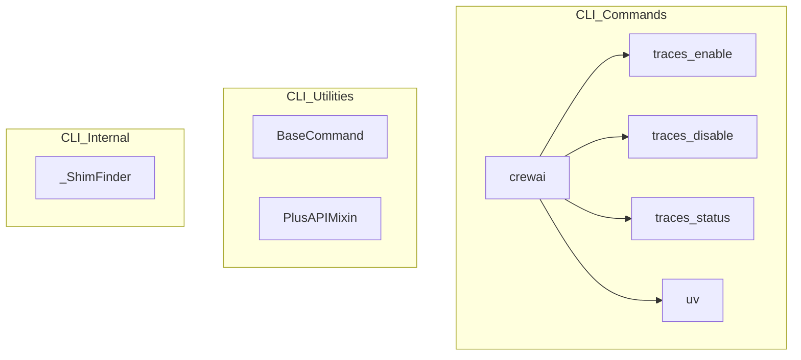

# trace_core_utilities
This module provides core utilities for the CrewAI CLI, including commands for managing trace collection, a `uv` wrapper, and foundational classes for API interaction and command structure.

<!-- DIAGRAM_JSON
{
    "nodes": [
        {
            "id": "traces_enable",
            "label": "traces_enable"
        },
        {
            "id": "traces_disable",
            "label": "traces_disable"
        },
        {
            "id": "traces_status",
            "label": "traces_status"
        },
        {
            "id": "uv",
            "label": "uv"
        },
        {
            "id": "crewai",
            "label": "crewai"
        },
        {
            "id": "PlusAPIMixin",
            "label": "PlusAPIMixin"
        },
        {
            "id": "BaseCommand",
            "label": "BaseCommand"
        },
        {
            "id": "_ShimFinder",
            "label": "_ShimFinder"
        }
    ],
    "edges": [
        {
            "source": "crewai",
            "target": "traces_enable"
        },
        {
            "source": "crewai",
            "target": "traces_disable"
        },
        {
            "source": "crewai",
            "target": "traces_status"
        },
        {
            "source": "crewai",
            "target": "uv"
        }
    ],
    "groups": [
        {
            "id": "CLI_Commands",
            "label": "CLI Commands",
            "nodes": [
                "crewai",
                "traces_enable",
                "traces_disable",
                "traces_status",
                "uv"
            ]
        },
        {
            "id": "CLI_Utilities",
            "label": "CLI Utilities",
            "nodes": [
                "BaseCommand",
                "PlusAPIMixin"
            ]
        },
        {
            "id": "CLI_Internal",
            "label": "CLI Internal",
            "nodes": [
                "_ShimFinder"
            ]
        }
    ]
}
-->
