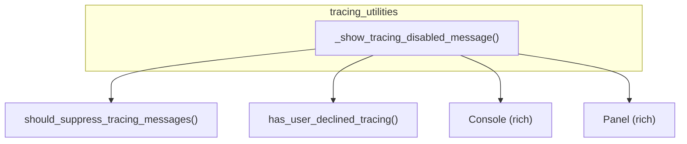

# tracing_utilities
This module provides utility functions for managing and displaying tracing status messages within the application. It primarily handles informing users when tracing is disabled and how to enable it.

<!-- DIAGRAM_JSON
{
    "nodes": [
        {
            "id": "tracing_utilities",
            "label": "tracing_utilities",
            "type": "module"
        },
        {
            "id": "_show_tracing_disabled_message",
            "label": "_show_tracing_disabled_message",
            "type": "function"
        },
        {
            "id": "should_suppress_tracing_messages",
            "label": "should_suppress_tracing_messages",
            "type": "function",
            "isExternal": true
        },
        {
            "id": "has_user_declined_tracing",
            "label": "has_user_declined_tracing",
            "type": "function",
            "isExternal": true
        },
        {
            "id": "Console",
            "label": "Console",
            "type": "class",
            "isExternal": true
        },
        {
            "id": "Panel",
            "label": "Panel",
            "type": "class",
            "isExternal": true
        }
    ],
    "edges": [
        {
            "source": "_show_tracing_disabled_message",
            "target": "should_suppress_tracing_messages"
        },
        {
            "source": "_show_tracing_disabled_message",
            "target": "has_user_declined_tracing"
        },
        {
            "source": "_show_tracing_disabled_message",
            "target": "Console"
        },
        {
            "source": "_show_tracing_disabled_message",
            "target": "Panel"
        }
    ],
    "groups": [
        {
            "id": "tracing_utilities_group",
            "label": "tracing_utilities",
            "nodes": [
                "_show_tracing_disabled_message"
            ]
        }
    ]
}
-->
