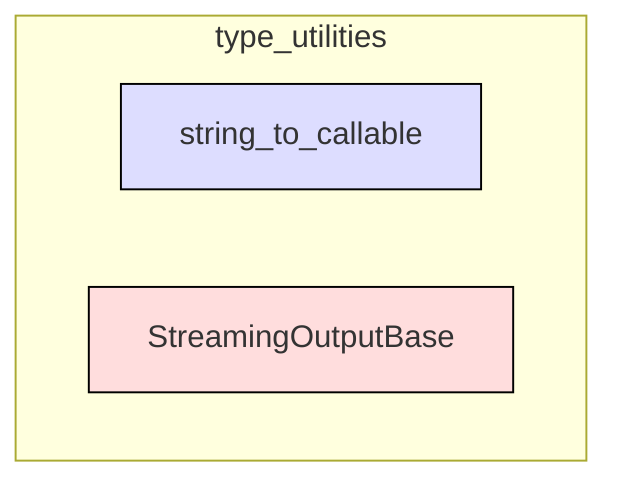

# type_utilities
This module provides utilities for converting string paths to callables and a base class for managing streaming output with result access.

<!-- DIAGRAM_JSON
{
    "nodes": [
        {
            "id": "string_to_callable",
            "label": "string_to_callable",
            "type": "function"
        },
        {
            "id": "StreamingOutputBase",
            "label": "StreamingOutputBase",
            "type": "class"
        }
    ],
    "edges": [],
    "groups": [
        {
            "id": "type_utilities",
            "label": "type_utilities",
            "nodes": [
                "string_to_callable",
                "StreamingOutputBase"
            ]
        }
    ]
}
-->
