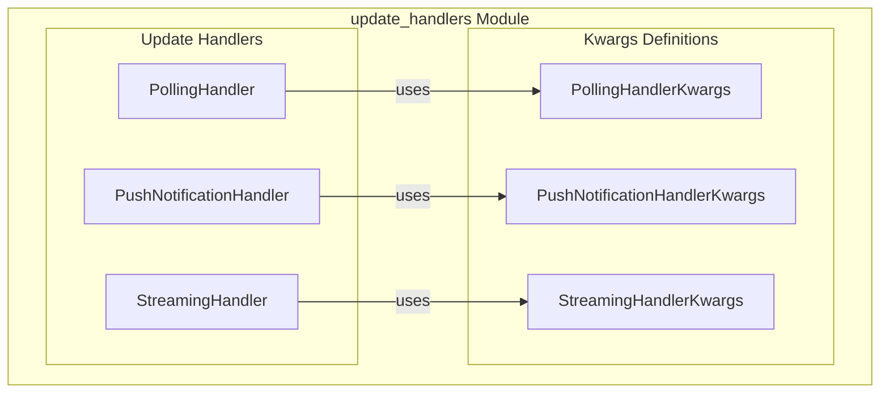

# update_handlers
This module defines various update handlers for A2A communication, including polling, streaming, and push notifications, along with their respective configuration keyword arguments.

<!-- DIAGRAM_JSON
{
  "nodes": [
    {"id": "PollingHandlerKwargs", "label": "PollingHandlerKwargs", "type": "class"},
    {"id": "StreamingHandlerKwargs", "label": "StreamingHandlerKwargs", "type": "class"},
    {"id": "PushNotificationHandlerKwargs", "label": "PushNotificationHandlerKwargs", "type": "class"},
    {"id": "PollingHandler", "label": "PollingHandler", "type": "class"},
    {"id": "PushNotificationHandler", "label": "PushNotificationHandler", "type": "class"},
    {"id": "StreamingHandler", "label": "StreamingHandler", "type": "class"}
  ],
  "edges": [
    {"source": "PollingHandler", "target": "PollingHandlerKwargs", "label": "uses"},
    {"source": "PushNotificationHandler", "target": "PushNotificationHandlerKwargs", "label": "uses"},
    {"source": "StreamingHandler", "target": "StreamingHandlerKwargs", "label": "uses"}
  ],
  "groups": [
    {
      "id": "KwargsDefinitions",
      "label": "Kwargs Definitions",
      "nodes": ["PollingHandlerKwargs", "StreamingHandlerKwargs", "PushNotificationHandlerKwargs"]
    },
    {
      "id": "UpdateHandlers",
      "label": "Update Handlers",
      "nodes": ["PollingHandler", "PushNotificationHandler", "StreamingHandler"]
    },
    {
      "id": "update_handlers_module",
      "label": "update_handlers Module",
      "groups": ["KwargsDefinitions", "UpdateHandlers"]
    }
  ]
}
-->
