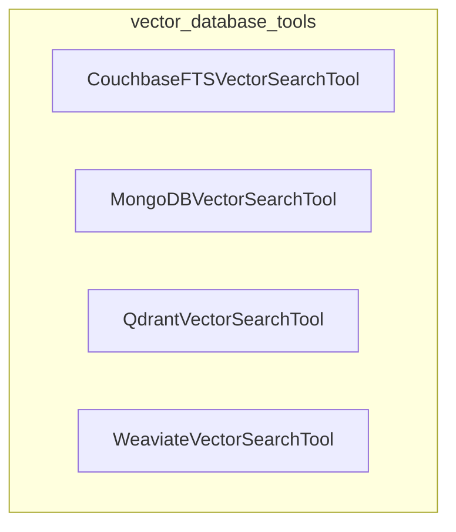

# vector_database_tools
This module provides a collection of tools for performing vector similarity searches across various NoSQL and vector databases, including Couchbase, MongoDB, Qdrant, and Weaviate.

<!-- DIAGRAM_JSON
{
  "nodes": [
    {"id": "CouchbaseFTSVectorSearchTool", "label": "CouchbaseFTSVectorSearchTool"},
    {"id": "MongoDBVectorSearchTool", "label": "MongoDBVectorSearchTool"},
    {"id": "QdrantVectorSearchTool", "label": "QdrantVectorSearchTool"},
    {"id": "WeaviateVectorSearchTool", "label": "WeaviateVectorSearchTool"}
  ],
  "edges": [],
  "groups": [
    {
      "id": "vector_database_tools",
      "label": "vector_database_tools",
      "nodes": [
        "CouchbaseFTSVectorSearchTool",
        "MongoDBVectorSearchTool",
        "QdrantVectorSearchTool",
        "WeaviateVectorSearchTool"
      ]
    }
  ]
}
-->
