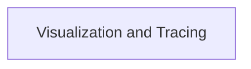

<!-- AUTO_GENERATED_PLACEHOLDER
  reason: LLM did not create .md file for this module
  module_path: crewai_core_framework/tasks_and_flow/flow_visualization_and_events/visualization_and_tracing
  component_count: 2
  generated_at: 2026-05-07T03:07:02.958962
-->

# Visualization and Tracing

Generates interactive HTML visualizations of CrewAI Flow structures and provides informative messages regarding tracing status for debugging.

<!-- DIAGRAM_JSON
{
    "direction": "TD",
    "nodes": [
        {
            "id": "visualization_and_tracing",
            "label": "Visualization and Tracing",
            "type": "module",
            "title": "Visualization and Tracing",
            "description": "Generates interactive HTML visualizations of CrewAI Flow structures and provides informative messages regarding tracing status for debugging."
        }
    ],
    "edges": [],
    "groups": []
}
-->

