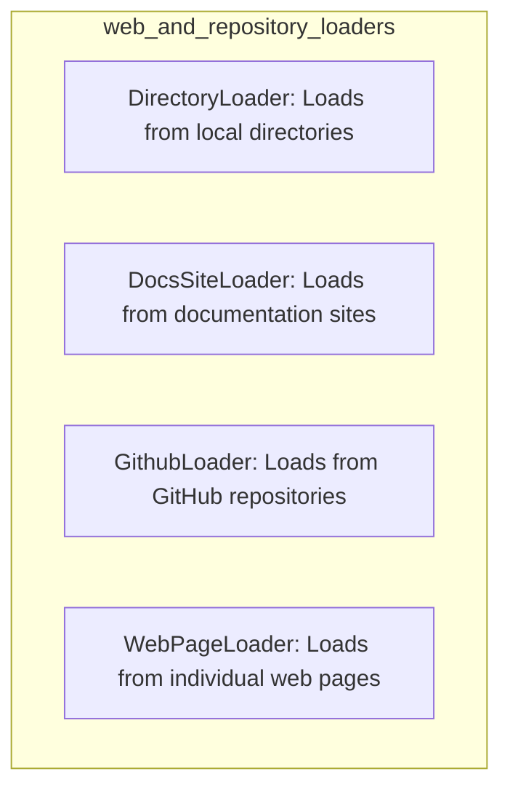

# web_and_repository_loaders
This module provides a collection of specialized loaders for retrieving content from diverse web and repository sources, including local directories, documentation sites, GitHub repositories, and individual web pages. Each loader is designed to fetch and parse specific content types into a standardized format.

<!-- DIAGRAM_JSON
{
    "nodes": [
        {
            "id": "web_and_repository_loaders",
            "label": "web_and_repository_loaders",
            "type": "module"
        },
        {
            "id": "DirectoryLoader",
            "label": "DirectoryLoader",
            "type": "component",
            "description": "Loads content from local directories."
        },
        {
            "id": "DocsSiteLoader",
            "label": "DocsSiteLoader",
            "type": "component",
            "description": "Loads content from documentation websites."
        },
        {
            "id": "GithubLoader",
            "label": "GithubLoader",
            "type": "component",
            "description": "Loads content from GitHub repositories."
        },
        {
            "id": "WebPageLoader",
            "label": "WebPageLoader",
            "type": "component",
            "description": "Loads content from individual web pages."
        }
    ],
    "edges": [],
    "groups": [
        {
            "id": "web_and_repository_loaders_group",
            "label": "web_and_repository_loaders",
            "nodes": [
                "DirectoryLoader",
                "DocsSiteLoader",
                "GithubLoader",
                "WebPageLoader"
            ]
        }
    ]
}
-->
