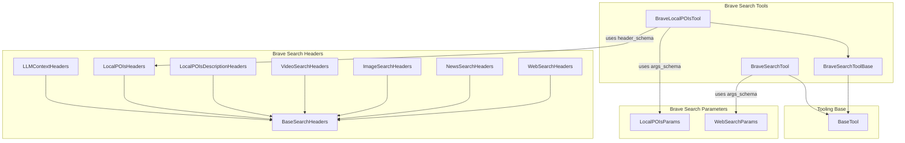

# web_search_and_scraping
This module provides tools for web searching and scraping using the Brave Search API, including a base class for API interactions, specific tools for web search and local POIs, and Pydantic schemas for request headers and parameters.

<!-- DIAGRAM_JSON
{
    "nodes": [
        {
            "id": "BraveSearchToolBase",
            "label": "BraveSearchToolBase"
        },
        {
            "id": "BraveLocalPOIsTool",
            "label": "BraveLocalPOIsTool"
        },
        {
            "id": "BraveSearchTool",
            "label": "BraveSearchTool"
        },
        {
            "id": "LLMContextHeaders",
            "label": "LLMContextHeaders"
        },
        {
            "id": "LocalPOIsHeaders",
            "label": "LocalPOIsHeaders"
        },
        {
            "id": "LocalPOIsDescriptionHeaders",
            "label": "LocalPOIsDescriptionHeaders"
        },
        {
            "id": "VideoSearchHeaders",
            "label": "VideoSearchHeaders"
        },
        {
            "id": "ImageSearchHeaders",
            "label": "ImageSearchHeaders"
        },
        {
            "id": "NewsSearchHeaders",
            "label": "NewsSearchHeaders"
        },
        {
            "id": "WebSearchHeaders",
            "label": "WebSearchHeaders"
        },
        {
            "id": "BaseSearchHeaders",
            "label": "BaseSearchHeaders"
        },
        {
            "id": "LocalPOIsParams",
            "label": "LocalPOIsParams"
        },
        {
            "id": "WebSearchParams",
            "label": "WebSearchParams"
        },
        {
            "id": "BaseTool",
            "label": "BaseTool"
        }
    ],
    "edges": [
        {
            "source": "BraveSearchToolBase",
            "target": "BaseTool",
            "label": "inherits"
        },
        {
            "source": "BraveLocalPOIsTool",
            "target": "BraveSearchToolBase",
            "label": "inherits"
        },
        {
            "source": "BraveLocalPOIsTool",
            "target": "LocalPOIsParams",
            "label": "uses args_schema"
        },
        {
            "source": "BraveLocalPOIsTool",
            "target": "LocalPOIsHeaders",
            "label": "uses header_schema"
        },
        {
            "source": "BraveSearchTool",
            "target": "BaseTool",
            "label": "inherits"
        },
        {
            "source": "BraveSearchTool",
            "target": "WebSearchParams",
            "label": "uses args_schema"
        },
        {
            "source": "LLMContextHeaders",
            "target": "BaseSearchHeaders",
            "label": "inherits"
        },
        {
            "source": "LocalPOIsHeaders",
            "target": "BaseSearchHeaders",
            "label": "inherits"
        },
        {
            "source": "LocalPOIsDescriptionHeaders",
            "target": "BaseSearchHeaders",
            "label": "inherits"
        },
        {
            "source": "VideoSearchHeaders",
            "target": "BaseSearchHeaders",
            "label": "inherits"
        },
        {
            "source": "ImageSearchHeaders",
            "target": "BaseSearchHeaders",
            "label": "inherits"
        },
        {
            "source": "NewsSearchHeaders",
            "target": "BaseSearchHeaders",
            "label": "inherits"
        },
        {
            "source": "WebSearchHeaders",
            "target": "BaseSearchHeaders",
            "label": "inherits"
        }
    ],
    "groups": [
        {
            "id": "Brave Search Tools",
            "label": "Brave Search Tools",
            "nodes": [
                "BraveSearchToolBase",
                "BraveLocalPOIsTool",
                "BraveSearchTool"
            ]
        },
        {
            "id": "Brave Search Headers",
            "label": "Brave Search Headers",
            "nodes": [
                "LLMContextHeaders",
                "LocalPOIsHeaders",
                "LocalPOIsDescriptionHeaders",
                "VideoSearchHeaders",
                "ImageSearchHeaders",
                "NewsSearchHeaders",
                "WebSearchHeaders",
                "BaseSearchHeaders"
            ]
        },
        {
            "id": "Brave Search Parameters",
            "label": "Brave Search Parameters",
            "nodes": [
                "LocalPOIsParams",
                "WebSearchParams"
            ]
        },
        {
            "id": "Tooling Base",
            "label": "Tooling Base",
            "nodes": [
                "BaseTool"
            ]
        }
    ]
}
-->
```
