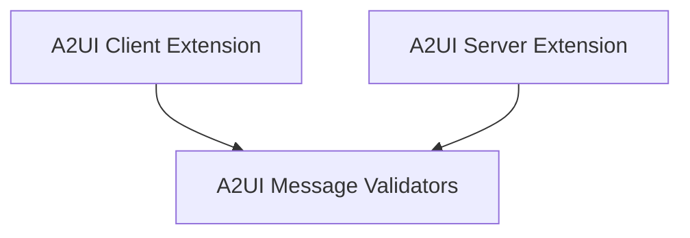

# A2A A2UI Extensions Module

## Introduction

The `a2a_a2ui_extensions` module provides crucial functionalities for integrating the A2UI (Agent to User Interface) protocol within the Agent-to-Agent (A2A) communication framework. It enables agents to generate declarative UI elements and interact with client-side UIs, facilitating richer and more interactive agent experiences. This module handles both client-side and server-side aspects of A2UI, ensuring seamless communication and validation of UI-related messages.

## Architecture Overview

This module is structured into three main sub-modules, each responsible for a distinct aspect of A2UI integration:

*   **A2UI Client Extension**: Manages how agents interact with A2UI on the client side, including prompt augmentation and processing agent responses for A2UI messages.
*   **A2UI Server Extension**: Handles the server-side aspects of A2UI, such as negotiating supported UI catalogs and converting A2UI messages from agent responses into A2A DataParts.
*   **A2UI Message Validators**: Provides utilities for validating A2UI events and catalog components to ensure compliance with the A2UI protocol specifications.

The following diagram illustrates the relationships between these sub-modules:

<!-- DIAGRAM_JSON
{
    "direction": "TD",
    "nodes": [
        {"id": "a2ui_client_extension", "label": "A2UI Client Extension", "type": "module", "link": "a2ui_client_extension.md"},
        {"id": "a2ui_server_extension", "label": "A2UI Server Extension", "type": "module", "link": "a2ui_server_extension.md"},
        {"id": "a2ui_validators", "label": "A2UI Message Validators", "type": "module", "link": "a2ui_validators.md"}
    ],
    "edges": [
        {"source": "a2ui_client_extension", "target": "a2ui_validators"},
        {"source": "a2ui_server_extension", "target": "a2ui_validators"}
    ],
    "groups": []
}
-->

## High-Level Functionality

### [A2UI Client Extension](a2ui_client_extension.md)

This sub-module is responsible for injecting A2UI prompt instructions into the agent's base prompt, tracking UI state across conversations by extracting A2UI DataParts from history, and validating A2UI messages received in agent responses. It acts as the bridge for agents to effectively utilize A2UI on the client side.

### [A2UI Server Extension](a2ui_server_extension.md)

This sub-module handles the server-side logic for A2UI. It includes negotiating catalog preferences with connecting clients during request processing and converting A2UI messages embedded within agent responses into structured A2A DataParts with the appropriate MIME type. This ensures that A2UI messages are correctly formatted and transmitted within the A2A framework.

### [A2UI Message Validators](a2ui_validators.md)

This sub-module provides core validation functions for A2UI. It is used to parse and validate client-to-server A2UI events and to validate component properties within `updateComponents` messages against defined catalog schemas. This ensures that all A2UI communications adhere to the specified protocol versions (v0.8 and v0.9).
