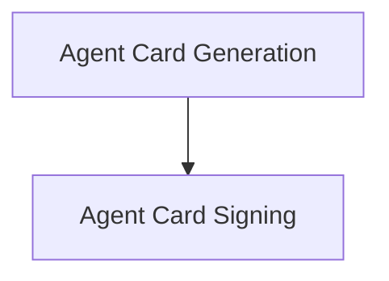

# A2A Agent Card Utilities

The `a2a_agent_card_utils` module provides essential utilities for managing AgentCards within the Agent-to-Agent (A2A) communication framework. This includes functionalities for generating agent cards from CrewAI agents and crews, as well as verifying their digital signatures to ensure secure and authentic interactions.

## Architecture Overview

The module is structured into two main sub-modules, focusing on the creation and security aspects of AgentCards. Below is an architectural diagram illustrating their relationship.

<!-- DIAGRAM_JSON
{
    "direction": "TD",
    "nodes": [
        {"id": "agent_card_generation", "label": "Agent Card Generation", "type": "module", "link": "agent_card_generation.md"},
        {"id": "agent_card_signing", "label": "Agent Card Signing", "type": "module", "link": "agent_card_signing.md"}
    ],
    "edges": [
        {"source": "agent_card_generation", "target": "agent_card_signing"}
    ],
    "groups": []
}
-->

## Sub-modules

### [Agent Card Generation](agent_card_generation.md)
This sub-module is responsible for creating `AgentCard` objects from `Agent` and `Crew` instances, detailing their roles, descriptions, and capabilities within the A2A ecosystem.

### [Agent Card Signing](agent_card_signing.md)
This sub-module handles the cryptographic verification of `AgentCard` signatures, ensuring the integrity and authenticity of the agent card's information using public-key cryptography.