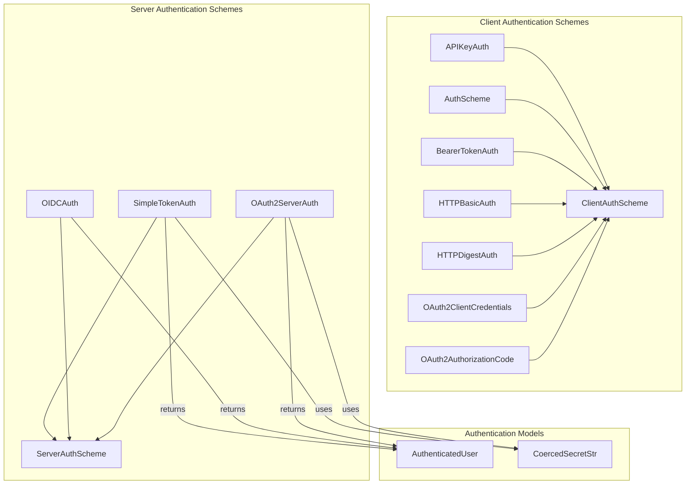

# a2a_auth
Provides a comprehensive suite of client-side and server-side authentication schemes for agent-to-agent (A2A) communication, supporting various protocols like API keys, OAuth2, OIDC, and basic/bearer tokens.

<!-- DIAGRAM_JSON
{
  "nodes": [
    {"id": "ClientAuthScheme", "label": "ClientAuthScheme"},
    {"id": "ServerAuthScheme", "label": "ServerAuthScheme"},
    {"id": "AuthenticatedUser", "label": "AuthenticatedUser"},
    {"id": "CoercedSecretStr", "label": "CoercedSecretStr"},
    {"id": "APIKeyAuth", "label": "APIKeyAuth"},
    {"id": "AuthScheme", "label": "AuthScheme"},
    {"id": "BearerTokenAuth", "label": "BearerTokenAuth"},
    {"id": "HTTPBasicAuth", "label": "HTTPBasicAuth"},
    {"id": "HTTPDigestAuth", "label": "HTTPDigestAuth"},
    {"id": "OAuth2ClientCredentials", "label": "OAuth2ClientCredentials"},
    {"id": "OAuth2AuthorizationCode", "label": "OAuth2AuthorizationCode"},
    {"id": "SimpleTokenAuth", "label": "SimpleTokenAuth"},
    {"id": "OIDCAuth", "label": "OIDCAuth"},
    {"id": "OAuth2ServerAuth", "label": "OAuth2ServerAuth"}
  ],
  "edges": [
    {"source": "APIKeyAuth", "target": "ClientAuthScheme", "label": "inherits"},
    {"source": "AuthScheme", "target": "ClientAuthScheme", "label": "inherits"},
    {"source": "BearerTokenAuth", "target": "ClientAuthScheme", "label": "inherits"},
    {"source": "HTTPBasicAuth", "target": "ClientAuthScheme", "label": "inherits"},
    {"source": "HTTPDigestAuth", "target": "ClientAuthScheme", "label": "inherits"},
    {"source": "OAuth2ClientCredentials", "target": "ClientAuthScheme", "label": "inherits"},
    {"source": "OAuth2AuthorizationCode", "target": "ClientAuthScheme", "label": "inherits"},
    {"source": "SimpleTokenAuth", "target": "ServerAuthScheme", "label": "inherits"},
    {"source": "OIDCAuth", "target": "ServerAuthScheme", "label": "inherits"},
    {"source": "OAuth2ServerAuth", "target": "ServerAuthScheme", "label": "inherits"},
    {"source": "SimpleTokenAuth", "target": "CoercedSecretStr", "label": "uses"},
    {"source": "OAuth2ServerAuth", "target": "CoercedSecretStr", "label": "uses"},
    {"source": "SimpleTokenAuth", "target": "AuthenticatedUser", "label": "returns"},
    {"source": "OIDCAuth", "target": "AuthenticatedUser", "label": "returns"},
    {"source": "OAuth2ServerAuth", "target": "AuthenticatedUser", "label": "returns"}
  ],
  "groups": [
    {"id": "client_schemes", "label": "Client Authentication Schemes", "nodes": ["ClientAuthScheme", "APIKeyAuth", "AuthScheme", "BearerTokenAuth", "HTTPBasicAuth", "HTTPDigestAuth", "OAuth2ClientCredentials", "OAuth2AuthorizationCode"]},
    {"id": "server_schemes", "label": "Server Authentication Schemes", "nodes": ["ServerAuthScheme", "SimpleTokenAuth", "OIDCAuth", "OAuth2ServerAuth"]},
    {"id": "auth_models", "label": "Authentication Models", "nodes": ["AuthenticatedUser", "CoercedSecretStr"]}
  ]
}
-->
