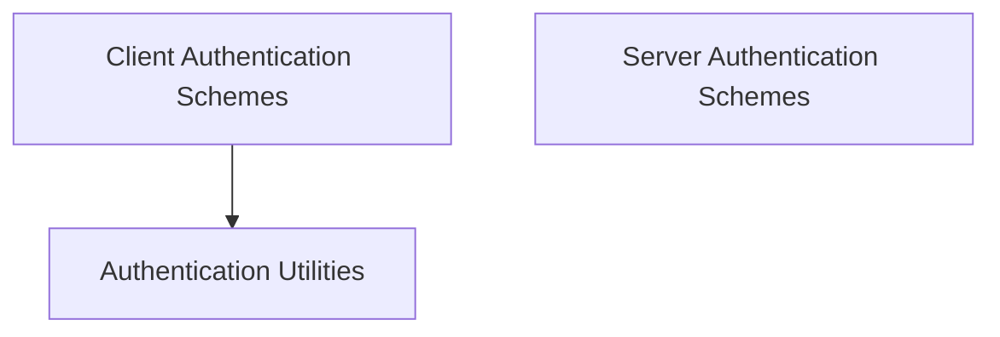

# A2A Authentication Schemes

This module provides a comprehensive set of authentication schemes for both client-side and server-side interactions within the Agent-to-Agent (A2A) communication framework. It enables secure and flexible authentication across various protocols and standards, including API keys, Bearer tokens, HTTP Basic/Digest, and OAuth2.

## Architecture Overview

The `a2a_auth_schemes` module is divided into client-side and server-side authentication components, along with utility functions. Client-side schemes facilitate agents' authentication when making requests to external services, while server-side schemes enable agents to secure their own endpoints. The utility functions provide common authentication-related operations.

<!-- DIAGRAM_JSON
{
    "direction": "TD",
    "nodes": [
        {"id": "client_auth_schemes", "label": "Client Authentication Schemes", "type": "module", "link": "client_auth_schemes.md"},
        {"id": "server_auth_schemes", "label": "Server Authentication Schemes", "type": "module", "link": "server_auth_schemes.md"},
        {"id": "auth_utils", "label": "Authentication Utilities", "type": "module", "link": "auth_utils.md"}
    ],
    "edges": [
        {"source": "client_auth_schemes", "target": "auth_utils"}
    ],
    "groups": []
}
-->

## Module Functionality

### [Client Authentication Schemes](client_auth_schemes.md)
This sub-module contains classes for various client-side authentication methods, allowing agents to securely interact with other services. It supports API Key, Bearer Token, HTTP Basic, HTTP Digest, and OAuth2 client credential and authorization code flows.

### [Server Authentication Schemes](server_auth_schemes.md)
This sub-module provides implementations for server-side authentication, enabling agents to secure their endpoints. Supported schemes include Simple Token, OIDC, OAuth2, API Key, mTLS, and Enterprise Token authentication.

### [Authentication Utilities](auth_utils.md)
This sub-module offers utility functions that assist with common authentication challenges, such as retrying requests gracefully upon receiving a 401 Unauthorized response.