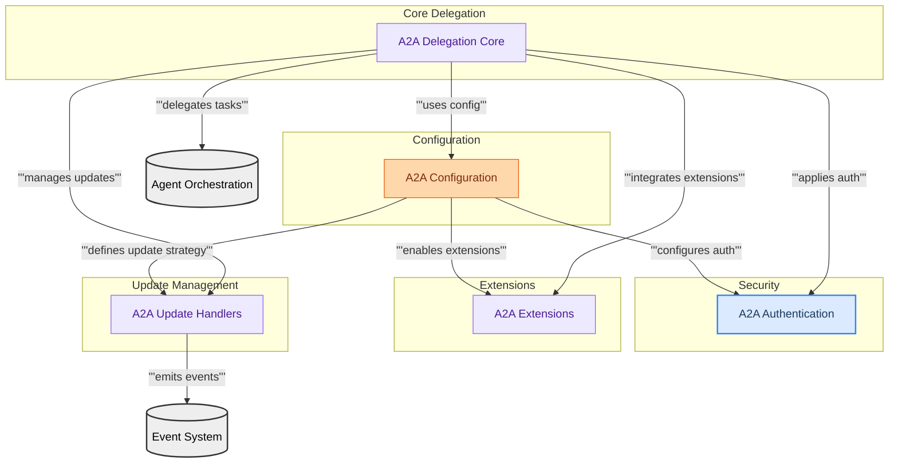

# A2A Communication
This module provides the foundational framework for Agent-to-Agent (A2A) communication, encompassing authentication, configuration, various update mechanisms, and extensible protocol features like A2UI for interactive delegation between agents.

<!-- DIAGRAM_JSON
{
    "direction": "TD",
    "nodes": [
        {"id": "a2a_auth", "label": "A2A Authentication", "type": "module", "link": "a2a_auth.md"},
        {"id": "a2a_config", "label": "A2A Configuration", "type": "module", "link": "a2a_config.md"},
        {"id": "a2a_extensions", "label": "A2A Extensions", "type": "module", "link": "a2a_extensions.md"},
        {"id": "a2a_updates", "label": "A2A Update Handlers", "type": "module", "link": "a2a_updates.md"},
        {"id": "a2a_delegation_core", "label": "A2A Delegation Core", "type": "module", "link": "a2a_delegation_core.md"},
        {"id": "agent_orchestration_ext", "label": "Agent Orchestration", "type": "external"},
        {"id": "event_system_ext", "label": "Event System", "type": "external"}
    ],
    "edges": [
        {"source": "a2a_config", "target": "a2a_auth", "label": "configures auth"},
        {"source": "a2a_config", "target": "a2a_updates", "label": "defines update strategy"},
        {"source": "a2a_config", "target": "a2a_extensions", "label": "enables extensions"},
        {"source": "a2a_delegation_core", "target": "a2a_config", "label": "uses config"},
        {"source": "a2a_delegation_core", "target": "a2a_auth", "label": "applies auth"},
        {"source": "a2a_delegation_core", "target": "a2a_updates", "label": "manages updates"},
        {"source": "a2a_delegation_core", "target": "a2a_extensions", "label": "integrates extensions"},
        {"source": "a2a_updates", "target": "event_system_ext", "label": "emits events"},
        {"source": "a2a_delegation_core", "target": "agent_orchestration_ext", "label": "delegates tasks"}
    ],
    "groups": [
        {"id": "configuration_group", "label": "Configuration", "role": "generative", "nodes": ["a2a_config"]},
        {"id": "security_group", "label": "Security", "role": "surface", "nodes": ["a2a_auth"]},
        {"id": "extension_group", "label": "Extensions", "role": "analytical", "nodes": ["a2a_extensions"]},
        {"id": "update_group", "label": "Update Management", "role": "analytical", "nodes": ["a2a_updates"]},
        {"id": "core_delegation_group", "label": "Core Delegation", "role": "analytical", "nodes": ["a2a_delegation_core"]}
    ]
}
-->
