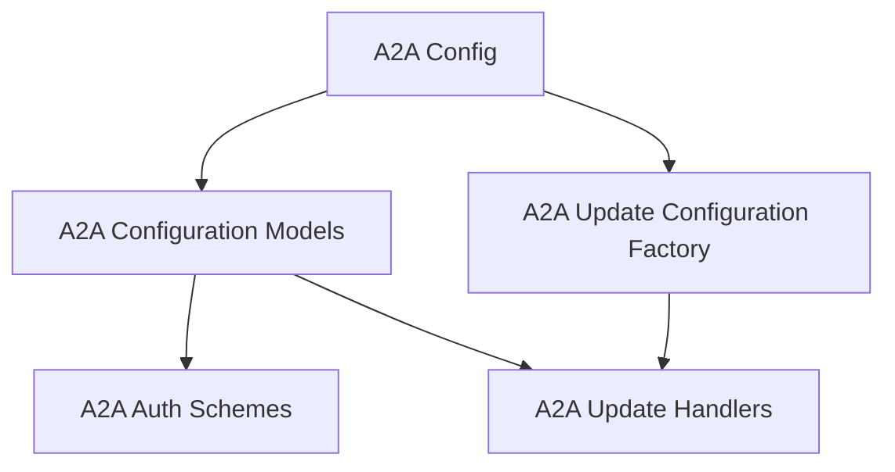

# A2A Config Module

The `a2a_config` module is responsible for managing the configuration settings for Agent-to-Agent (A2A) communication within CrewAI. It defines how agents connect, authenticate, handle timeouts, and manage updates and extensions for seamless interaction between different agent instances.

## Architecture

The module is structured to provide clear separation between configuration models and the logic for generating default configurations. It integrates with authentication schemes and update handlers to ensure robust and secure A2A communication.

<!-- DIAGRAM_JSON
{
    "direction": "TD",
    "nodes": [
        {"id": "a2a_config", "label": "A2A Config", "type": "module", "link": "a2a_config.md"},
        {"id": "a2a_configuration_models", "label": "A2A Configuration Models", "type": "module", "link": "a2a_configuration_models.md"},
        {"id": "a2a_update_config_factory", "label": "A2A Update Configuration Factory", "type": "module", "link": "a2a_update_config_factory.md"},
        {"id": "a2a_auth_schemes", "label": "A2A Auth Schemes", "type": "module", "link": "a2a_auth_schemes.md"},
        {"id": "a2a_update_handlers", "label": "A2A Update Handlers", "type": "module", "link": "a2a_update_handlers.md"}
    ],
    "edges": [
        {"source": "a2a_config", "target": "a2a_configuration_models"},
        {"source": "a2a_config", "target": "a2a_update_config_factory"},
        {"source": "a2a_configuration_models", "target": "a2a_auth_schemes"},
        {"source": "a2a_configuration_models", "target": "a2a_update_handlers"},
        {"source": "a2a_update_config_factory", "target": "a2a_update_handlers"}
    ],
    "groups": []
}
-->

## Sub-modules

### [A2A Configuration Models](a2a_configuration_models.md)
This sub-module defines the data models for A2A client and server configurations, including authentication, timeouts, and extension handling. It contains the core classes for configuring A2A interactions.

### [A2A Update Configuration Factory](a2a_update_config_factory.md)
This sub-module provides a factory method to generate default update configurations for A2A communications, primarily for streaming updates. It ensures that update mechanisms are properly initialized.
