# A2A Configuration
This module provides configurations for Agent-to-Agent (A2A) communication, handling connection parameters, authentication, update mechanisms, and client-side extensions for seamless inter-agent interactions.
<!-- DIAGRAM_JSON
{
    "direction": "TD",
    "nodes": [
        {"id": "a2a_client_config", "label": "A2AClientConfig", "type": "component", "link": null},
        {"id": "a2a_config_deprecated", "label": "A2AConfig (Deprecated)", "type": "component", "link": null},
        {"id": "get_default_update_config", "label": "_get_default_update_config()", "type": "component", "link": null},
        {"id": "client_auth_scheme", "label": "ClientAuthScheme", "type": "external", "link": "a2a_auth.md"},
        {"id": "update_config", "label": "UpdateConfig", "type": "external", "link": "a2a_updates.md"},
        {"id": "streaming_config", "label": "StreamingConfig", "type": "external", "link": "a2a_updates.md"},
        {"id": "validated_a2a_extension", "label": "ValidatedA2AExtension", "type": "external", "link": "a2a_extensions.md"},
        {"id": "client_transport_config", "label": "ClientTransportConfig", "type": "component", "link": null}
    ],
    "edges": [
        {"source": "a2a_client_config", "target": "client_auth_scheme", "label": "configures authentication"},
        {"source": "a2a_client_config", "target": "update_config", "label": "defines update mechanism"},
        {"source": "a2a_client_config", "target": "validated_a2a_extension", "label": "uses client extensions"},
        {"source": "a2a_client_config", "target": "client_transport_config", "label": "specifies transport"},
        {"source": "a2a_config_deprecated", "target": "client_auth_scheme", "label": "configures authentication"},
        {"source": "a2a_config_deprecated", "target": "update_config", "label": "defines update mechanism"},
        {"source": "a2a_config_deprecated", "target": "validated_a2a_extension", "label": "uses client extensions"},
        {"source": "a2a_config_deprecated", "target": "client_transport_config", "label": "specifies transport"},
        {"source": "get_default_update_config", "target": "streaming_config", "label": "returns default"},
        {"source": "a2a_client_config", "target": "get_default_update_config", "label": "default update config from"},
        {"source": "a2a_config_deprecated", "target": "get_default_update_config", "label": "default update config from"}
    ],
    "groups": [
        {"id": "main_configs", "label": "A2A Configurations", "role": "analytical", "nodes": ["a2a_client_config", "a2a_config_deprecated"]}
    ]
}
-->

```mermaid
flowchart TD
    subgraph main_configs["A2A Configurations"]
        a2a_client_config["A2AClientConfig"]
        a2a_config_deprecated["A2AConfig (Deprecated)"]
    end

    get_default_update_config["_get_default_update_config()"]

    client_auth_scheme["ClientAuthScheme"]
    update_config["UpdateConfig"]
    streaming_config["StreamingConfig"]
    validated_a2a_extension["ValidatedA2AExtension"]
    client_transport_config["ClientTransportConfig"]

    a2a_client_config -->|"configures authentication"| client_auth_scheme
    a2a_client_config -->|"defines update mechanism"| update_config
    a2a_client_config -->|"uses client extensions"| validated_a2a_extension
    a2a_client_config -->|"specifies transport"| client_transport_config

    a2a_config_deprecated -->|"configures authentication"| client_auth_scheme
    a2a_config_deprecated -->|"defines update mechanism"| update_config
    a2a_config_deprecated -->|"uses client extensions"| validated_a2a_extension
    a2a_config_deprecated -->|"specifies transport"| client_transport_config

    get_default_update_config -->|"returns default"| streaming_config

    a2a_client_config -.->|"default update config from"| get_default_update_config
    a2a_config_deprecated -.->|"default update config from"| get_default_update_config

    classDef analytical fill:#ede9fe,stroke:#8b5cf6,stroke-width:1px,color:#4c1d95
    classDef external fill:#dbeafe,stroke:#3b82f6,stroke-width:2px,color:#1e3a5f

    class a2a_client_config,a2a_config_deprecated,get_default_update_config,client_transport_config analytical
    class client_auth_scheme,update_config,streaming_config,validated_a2a_extension external

    click client_auth_scheme "a2a_auth.md" "View A2A Auth Module"
    click update_config "a2a_updates.md" "View A2A Updates Module"
    click streaming_config "a2a_updates.md" "View A2A Updates Module"
    click validated_a2a_extension "a2a_extensions.md" "View A2A Extensions Module"
```
