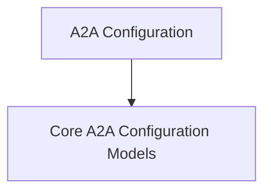

# A2A Configuration Models

The `a2a_configuration_models` module provides the core Pydantic models for configuring the Agent-to-Agent (A2A) communication protocol within CrewAI. These models define the necessary settings for clients to connect to and interact with remote A2A agents, including authentication, timeouts, response handling, and transport mechanisms.

## Architecture Overview:
The `a2a_configuration_models` module is a crucial part of the overall [a2a_config](a2a_config.md) module, which in turn belongs to the broader [crewai_agent_to_agent_communication](crewai_agent_to_agent_communication.md) system. It centralizes the data structures required for robust A2A client configurations.

<!-- DIAGRAM_JSON
{
    "direction": "TD",
    "nodes": [
        {"id": "a2a_config", "label": "A2A Configuration", "type": "module", "link": "a2a_config.md"},
        {"id": "a2a_configuration_models_core", "label": "Core A2A Configuration Models", "type": "module", "link": "a2a_configuration_models_core.md"}
    ],
    "edges": [
        {"source": "a2a_config", "target": "a2a_configuration_models_core"}
    ],
    "groups": []
}
-->

## Sub-modules:

- **[Core A2A Configuration Models](a2a_configuration_models_core.md):** This sub-module contains `A2AConfig` (deprecated) and `A2AClientConfig` models, which are fundamental for defining how agents communicate. They encapsulate settings related to endpoints, authentication, timeouts, and response handling.
