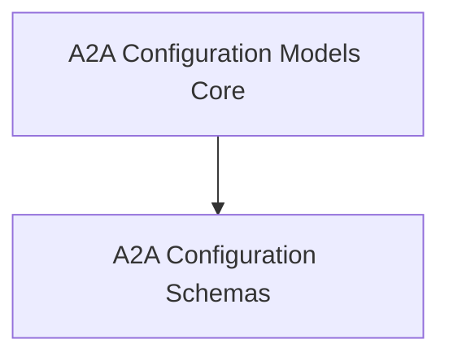

# A2A Configuration Models Core

## Introduction
This module, `a2a_configuration_models_core`, is responsible for defining the core Pydantic models used to configure the Agent-to-Agent (A2A) communication protocol within CrewAI. It provides foundational structures for both general A2A configurations and client-specific settings, ensuring robust and type-safe management of A2A parameters.

## Architecture Overview

The `a2a_configuration_models_core` module primarily encapsulates data models. It depends on various internal CrewAI utilities and external libraries for features such as URL validation (`Url`), authentication schemes (`ClientAuthScheme`), and update mechanisms (`UpdateConfig`). These models are crucial for configuring how agents connect, authenticate, and communicate with each other, especially in distributed or multi-agent environments.

<!-- DIAGRAM_JSON
{
    "direction": "TD",
    "nodes": [
        {"id": "a2a_configuration_models_schemas", "label": "A2A Configuration Schemas", "type": "module", "link": "a2a_configuration_models_schemas.md"}
    ],
    "edges": [],
    "groups": []
}
-->

## Sub-modules

Here's a breakdown of the key sub-modules within `a2a_configuration_models_core`:

*   **[A2A Configuration Schemas](a2a_configuration_models_schemas.md)**: This sub-module contains the Pydantic models, `A2AConfig` and `A2AClientConfig`, which define the structure for A2A communication settings.