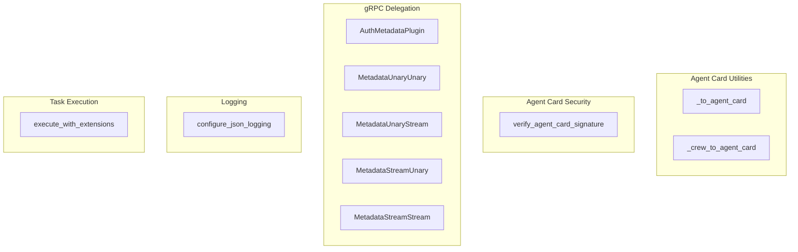

# a2a_delegation_core
This module provides core utilities for Agent-to-Agent (A2A) communication, including agent card generation and signing, gRPC delegation mechanisms, JSON logging, and task execution with extension hooks.

<!-- DIAGRAM_JSON
{
  "nodes": [
    {"id": "_to_agent_card", "label": "_to_agent_card", "type": "function"},
    {"id": "_crew_to_agent_card", "label": "_crew_to_agent_card", "type": "function"},
    {"id": "verify_agent_card_signature", "label": "verify_agent_card_signature", "type": "function"},
    {"id": "AuthMetadataPlugin", "label": "AuthMetadataPlugin", "type": "class"},
    {"id": "MetadataUnaryUnary", "label": "MetadataUnaryUnary", "type": "class"},
    {"id": "MetadataUnaryStream", "label": "MetadataUnaryStream", "type": "class"},
    {"id": "MetadataStreamUnary", "label": "MetadataStreamUnary", "type": "class"},
    {"id": "MetadataStreamStream", "label": "MetadataStreamStream", "type": "class"},
    {"id": "configure_json_logging", "label": "configure_json_logging", "type": "function"},
    {"id": "execute_with_extensions", "label": "execute_with_extensions", "type": "function"}
  ],
  "edges": [],
  "groups": [
    {"id": "agent_card_utils", "label": "Agent Card Utilities", "nodes": ["_to_agent_card", "_crew_to_agent_card"]},
    {"id": "agent_card_security", "label": "Agent Card Security", "nodes": ["verify_agent_card_signature"]},
    {"id": "grpc_delegation", "label": "gRPC Delegation", "nodes": ["AuthMetadataPlugin", "MetadataUnaryUnary", "MetadataUnaryStream", "MetadataStreamUnary", "MetadataStreamStream"]},
    {"id": "logging", "label": "Logging", "nodes": ["configure_json_logging"]},
    {"id": "task_execution", "label": "Task Execution", "nodes": ["execute_with_extensions"]}
  ]
}
-->
