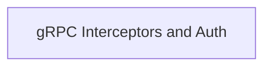

# a2a_delegation_utils

The `a2a_delegation_utils` module, part of the larger [crewai_agent_to_agent_communication](crewai_agent_to_agent_communication.md) system, is responsible for handling secure and structured delegation within the Agent-to-Agent (A2A) communication framework. Its primary function is to facilitate the injection of authentication metadata into gRPC calls, ensuring that delegated tasks and communications are properly authorized and authenticated.

## Architecture

The module is structured around gRPC client interceptors and a dedicated authentication metadata plugin. These components work together to ensure that outgoing gRPC requests from agents include necessary authentication details, enabling secure delegation of tasks and information exchange.

<!-- DIAGRAM_JSON
{
    "direction": "TD",
    "nodes": [
        {"id": "grpc_interceptors", "label": "gRPC Interceptors and Auth", "type": "module", "link": "grpc_interceptors.md"}
    ],
    "edges": [],
    "groups": []
}
-->

## Sub-modules

### [gRPC Interceptors and Auth](grpc_interceptors.md)

This sub-module provides the core mechanisms for intercepting gRPC client calls and injecting authentication metadata. It includes specialized interceptors for different gRPC communication patterns (unary-unary, unary-stream, stream-unary, stream-stream) and an authentication metadata plugin that handles the actual injection of auth headers. This ensures that all A2A gRPC communications carry the necessary credentials for secure delegation.