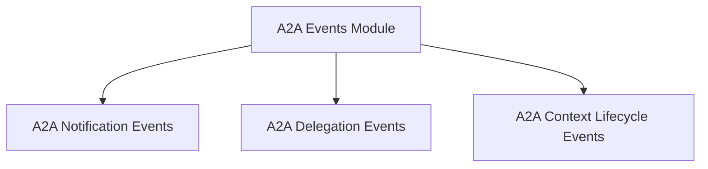

# A2A Events Module Documentation

## Introduction
The `a2a_events` module is a crucial part of the CrewAI agent-to-agent communication system, defining the various events that occur during inter-agent interactions. These events provide observability into the lifecycle of A2A tasks, contexts, notifications, and delegation processes, enabling robust monitoring, debugging, and advanced workflow orchestration.

## Architecture Overview
The `a2a_events` module is structured around different categories of events, each representing a distinct aspect of agent-to-agent communication. It categorizes events into those related to notifications and agent metadata, task delegation, and the overall lifecycle of an A2A interaction context. This organization ensures a clear separation of concerns and facilitates easy tracking of various A2A activities.

<!-- DIAGRAM_JSON
{
    "direction": "TD",
    "nodes": [
        {"id": "notification_events", "label": "A2A Notification Events", "type": "module", "link": "notification_events.md"},
        {"id": "delegation_events", "label": "A2A Delegation Events", "type": "module", "link": "delegation_events.md"},
        {"id": "context_lifecycle_events", "label": "A2A Context Lifecycle Events", "type": "module", "link": "context_lifecycle_events.md"}
    ],
    "edges": [
        {"source": "notification_events", "target": "crewai_agent_to_agent_communication"},
        {"source": "delegation_events", "target": "crewai_agent_to_agent_communication"},
        {"source": "context_lifecycle_events", "target": "crewai_agent_to_agent_communication"}
    ],
    "groups": []
}
-->

## Sub-modules
This module is composed of the following sub-modules, each focusing on a specific aspect of A2A event handling:

*   ### A2A Notification Events
    This sub-module defines events related to push notifications and the fetching of agent cards, crucial for real-time updates and agent discovery.
    For more details, refer to the [A2A Notification Events Documentation](notification_events.md).

*   ### A2A Delegation Events
    This sub-module encapsulates events that mark the initiation and completion of tasks delegated in parallel to multiple A2A agents, providing insights into the parallel processing workflow.
    For more details, refer to the [A2A Delegation Events Documentation](delegation_events.md).

*   ### A2A Context Lifecycle Events
    This sub-module focuses on events that track the creation, various state changes (e.g., idle, expired), completion, and eventual pruning of A2A interaction contexts. These events are vital for managing the lifetime of agent conversations and workflows.
    For more details, refer to the [A2A Context Lifecycle Events Documentation](context_lifecycle_events.md).
