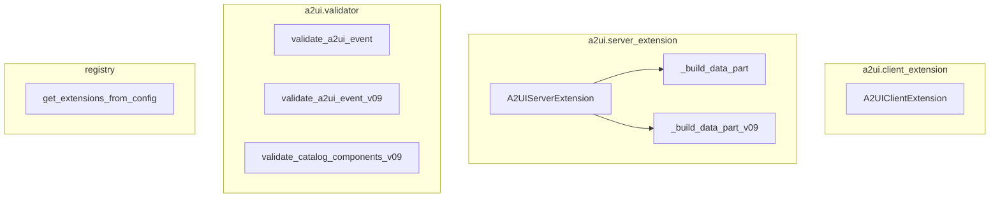

# a2a_extensions
This module provides client and server-side extensions for A2A, primarily focusing on A2UI declarative UI generation and validation, along with a utility for extracting extension URIs from A2A configurations.

<!-- DIAGRAM_JSON
{
  "nodes": [
    {"id": "A2UIClientExt", "label": "A2UIClientExtension"},
    {"id": "A2UIServerExt", "label": "A2UIServerExtension"},
    {"id": "BuildDataPart", "label": "_build_data_part"},
    {"id": "BuildDataPartV09", "label": "_build_data_part_v09"},
    {"id": "ValidateEvent", "label": "validate_a2ui_event"},
    {"id": "ValidateEventV09", "label": "validate_a2ui_event_v09"},
    {"id": "ValidateCatalogV09", "label": "validate_catalog_components_v09"},
    {"id": "GetExtensions", "label": "get_extensions_from_config"}
  ],
  "edges": [
    {"source": "A2UIServerExt", "target": "BuildDataPart"},
    {"source": "A2UIServerExt", "target": "BuildDataPartV09"}
  ],
  "groups": [
    {"id": "a2ui_client_extension", "label": "a2ui.client_extension", "nodes": ["A2UIClientExt"]},
    {"id": "a2ui_server_extension", "label": "a2ui.server_extension", "nodes": ["A2UIServerExt", "BuildDataPart", "BuildDataPartV09"]},
    {"id": "a2ui_validator", "label": "a2ui.validator", "nodes": ["ValidateEvent", "ValidateEventV09", "ValidateCatalogV09"]},
    {"id": "registry", "label": "registry", "nodes": ["GetExtensions"]}
  ]
}
-->
