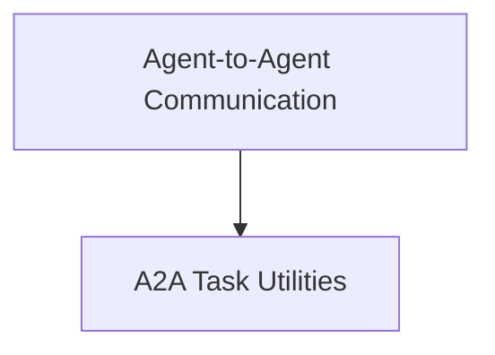

# A2A Task Utilities (`a2a_task_utils`)

This module, `a2a_task_utils`, is a core part of the broader [Agent-to-Agent Communication (A2A)](crewai_agent_to_agent_communication.md) system within CrewAI. It provides essential utility functions for managing task execution and handling cancellations in an asynchronous, distributed agent environment. Its primary responsibilities include facilitating task execution with integrated extension hooks and offering robust mechanisms for monitoring and responding to task cancellation requests.

## Architecture Overview

The `a2a_task_utils` module integrates seamlessly with the A2A communication framework to ensure tasks are executed efficiently and can be gracefully interrupted when necessary. It leverages event queues for inter-agent communication and caching mechanisms to propagate cancellation signals across the system.

<!-- DIAGRAM_JSON
{
    "direction": "TD",
    "nodes": [
        {"id": "crewai_agent_to_agent_communication", "label": "Agent-to-Agent Communication", "type": "module", "link": "crewai_agent_to_agent_communication.md"},
        {"id": "a2a_task_utils", "label": "A2A Task Utilities", "type": "module", "link": "a2a_task_utils.md"}
    ],
    "edges": [
        {"source": "crewai_agent_to_agent_communication", "target": "a2a_task_utils"}
    ],
    "groups": []
}
-->

## High-Level Functionality

### `execute_with_extensions`

This function orchestrates the execution of an A2A task, incorporating various extension hooks defined within the system. It serves as a central point for launching tasks, ensuring that agents can perform their work while adhering to the A2A framework's requirements for context management, event handling, and extensibility.

**Core Component**: `lib.crewai.src.crewai.a2a.utils.task.execute_with_extensions`

**Purpose**:
-   **Task Orchestration**: Manages the lifecycle of an A2A task from initiation to completion.
-   **Extension Integration**: Allows for custom behaviors or integrations to be injected at different stages of task execution through extension hooks.
-   **Contextual Execution**: Ensures tasks are executed within the appropriate A2A `RequestContext` and can communicate via the `EventQueue`.

**Usage**:
This asynchronous function takes an `Agent`, `RequestContext`, `EventQueue`, `ServerExtensionRegistry`, and `ExtensionContext` as inputs to facilitate a flexible and observable task execution flow.

### `watch_for_cancel`

This utility provides a robust mechanism to monitor for and respond to task cancellation events. It supports both pub/sub models (e.g., Redis) and polling methods to detect when a task has been flagged for cancellation. This ensures that long-running or critical tasks can be interrupted gracefully, preventing resource wastage and improving overall system responsiveness.

**Core Component**: `lib.crewai.src.crewai.a2a.utils.task.watch_for_cancel`

**Purpose**:
-   **Graceful Cancellation**: Enables tasks to be stopped cleanly when a cancellation signal is received.
-   **Fault Tolerance**: Automatically falls back to a polling mechanism if the primary pub/sub system (like Redis) experiences connectivity issues, ensuring cancellation detection remains operational.
-   **Resource Management**: Helps in releasing resources promptly when a task is no longer needed.

**Usage**:
This asynchronous function continuously monitors for a cancellation signal for a given `task_id`. It prioritizes a pub/sub mechanism for real-time updates but can revert to periodic polling for resilience.
