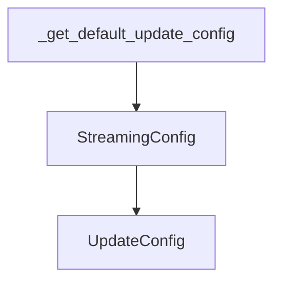

# `a2a_update_config_factory` Module Documentation

## Introduction

The `a2a_update_config_factory` module is responsible for providing the default update configuration for Agent-to-Agent (A2A) communication within the CrewAI framework. It primarily offers a factory function to retrieve a standard `UpdateConfig` instance, defaulting to a `StreamingConfig` for efficient real-time updates.

## Core Functionality

The main component of this module is the `_get_default_update_config` function. This function serves as a factory to instantiate and return a default update configuration.

### `_get_default_update_config`

- **Purpose**: Returns a default `UpdateConfig` for A2A communication.
- **Implementation**: It currently instantiates and returns a `StreamingConfig` from the `a2a_update_handlers` module, indicating that streaming is the preferred default mechanism for updates.

```python
def _get_default_update_config() -> UpdateConfig:
    from crewai.a2a.updates import StreamingConfig

    return StreamingConfig()
```

## Architecture and Component Relationships

This module is a leaf module within the `a2a_config` sub-module. It primarily interacts with the `a2a_update_handlers` module to obtain the concrete update configuration types and the `a2a_configuration_models` module for the base `UpdateConfig` type.

<!-- DIAGRAM_JSON
{
    "direction": "TD",
    "nodes": [
        {"id": "_get_default_update_config", "label": "_get_default_update_config", "type": "component", "link": null},
        {"id": "streaming_config", "label": "StreamingConfig", "type": "external", "link": "a2a_update_handlers.md"},
        {"id": "update_config", "label": "UpdateConfig", "type": "external", "link": "a2a_configuration_models.md"}
    ],
    "edges": [
        {"source": "_get_default_update_config", "target": "streaming_config"},
        {"source": "streaming_config", "target": "update_config"}
    ],
    "groups": []
}
-->
