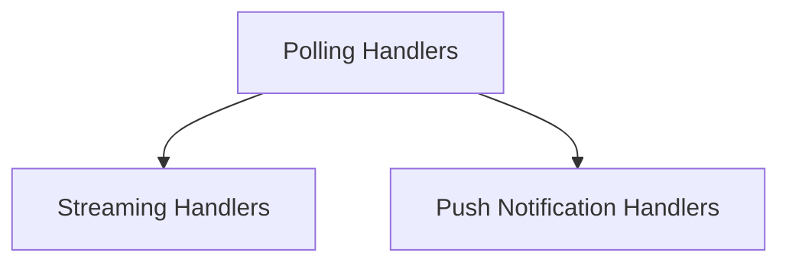

# A2A Update Handlers Module Documentation

## Introduction

The `a2a_update_handlers` module is a crucial part of the Agent-to-Agent (A2A) communication system within CrewAI. It is responsible for managing how agents receive and process updates during delegation, ensuring seamless and reliable information exchange. This module provides different strategies for handling updates, including polling, streaming, and push notifications, allowing for flexible integration into various operational environments.

## Architecture Overview

The module is composed of several sub-modules, each dedicated to a specific update handling mechanism. These handlers interact with the A2A client to send messages and receive task state updates, leveraging event buses for logging and status tracking. The overall architecture is designed for fault tolerance, with mechanisms for recovery from interruptions.

<!-- DIAGRAM_JSON
{
    "direction": "TD",
    "nodes": [
        {"id": "polling_handlers", "label": "Polling Handlers", "type": "module", "link": "polling_handlers.md"},
        {"id": "streaming_handlers", "label": "Streaming Handlers", "type": "module", "link": "streaming_handlers.md"},
        {"id": "push_notification_handlers", "label": "Push Notification Handlers", "type": "module", "link": "push_notification_handlers.md"}
    ],
    "edges": [
        {"source": "polling_handlers", "target": "streaming_handlers"},
        {"source": "polling_handlers", "target": "push_notification_handlers"}
    ],
    "groups": []
}
-->

## Sub-modules

### [Polling Handlers](polling_handlers.md)

This sub-module implements a polling-based mechanism for receiving updates. It is responsible for sending initial messages, periodically querying for task status, and processing the received task states. It includes error handling for timeouts and HTTP errors, and emits relevant events to the CrewAI event bus.

### [Streaming Handlers](streaming_handlers.md)

This sub-module provides an SSE streaming-based approach for real-time updates. It manages the continuous reception of event streams, processes messages and task artifact updates, and includes sophisticated recovery logic to handle stream interruptions and resubscriptions, ensuring robust communication.

### [Push Notification Handlers](push_notification_handlers.md)

This sub-module handles updates through push notifications (webhooks). It requires a `PushNotificationConfig` and `PushNotificationResultStore` to register callbacks and store results. It manages sending initial messages and waiting for asynchronous push notifications to deliver the task completion status. It also includes comprehensive error handling and event emission.